# AI201 — Lecture 3: Search (DIY Handout)

**Covers all three Lecture 3 videos** — 3A *Blind Search* (1:24:04, 41 slides), 3B *Heuristic Search* (44:23, 25 slides), 3C *Adversarial Search* (59:20, 34 slides) — by Pros Naval (CVMIG, University of the Philippines).

_Sources: the verified transcripts in `transcripts/` (each produced by two independent Whisper passes with identical results — 99-100% coverage, no divergent windows), all 100 deck slides extracted frame-by-frame into `frames/{3A,3B,3C}/slide-NN.png`, and 65 pointing frames (`frames/*/point-HHMMSS.png`) captured at the moments the instructor's laser dot or cursor marks what he is talking about. Every timestamp cites a `**[HH:MM:SS]**` marker in the corresponding transcript. Compiled 2026-09-01._

**The arc of Lecture 3** — one search story in three escalations:

| Part | Lecture | You know… | Machinery |
|---|---|---|---|
| **A** | Blind Search | nothing about distances to the goal | BFS, UCS, DFS, DLS, IDS, bidirectional — one GENERAL-SEARCH, six queuing functions |
| **B** | Heuristic Search | an *estimate* h(n) of remaining cost | greedy best-first (h only), A* (f = g + h) and its guarantees, IDA* |
| **C** | Adversarial Search | an *opponent* fights back | minimax, alpha-beta pruning, evaluation functions, MCTS, expectiminimax |

The connective tissue the instructor keeps returning to: **knowledge trades against search** — Part A compensates for zero knowledge with exponential search; Part B buys efficiency with an admissible h(n); Part C spends its knowledge budget on evaluation functions and pruning because an adversary and a clock make full search impossible.

---

# Part A — Blind Search (Lecture 3A)

Source: `_generated/transcripts/Lecture_3A_Blind_Search.md` (full lecture, [00:00:00]–[01:23:58]) plus the 41-slide deck. All timestamps cite the transcript; slide figures are embedded from `frames/3A/`. This is the **first of the three parts of Lecture 3 on search**: 3A covers *uninformed (blind)* search, 3B moves to *informed (heuristic)* search — greedy and A\* — and 3C to *adversarial* search (games). The lecture's arc [00:00:00]: define the **problem-solving agent**, classify the **four problem types**, build the machinery for **searching for solutions** (search trees, the general search algorithm), then work through **six blind search strategies** — BFS, uniform cost, DFS, depth-limited, iterative deepening, bidirectional — and end by **comparing them** on completeness, optimality, time, and space.

---

## A.1 The problem-solving agent [00:00:39]

> A **problem-solving agent** is a **goal-based agent that decides what to do by finding sequences of actions that lead to desirable states** [00:00:39].

The key word is *sequences*: the agent from Lecture 2 that reaches its goal in one step is not the interesting case — *"it has to undertake not just one action but a sequence of actions"* [00:01:10].

A problem-solving agent must do three things [00:01:46]:

| # | Step | What it means |
|---|---|---|
| 1 | **Formulate** | state its problem and its goal |
| 2 | **Search** | find the action sequence that achieves the goal |
| 3 | **Execute** | perform the best action sequence it has found |

The four working terms, defined precisely [00:01:46]:

- **Goal** — *the set of world states that the agent would like to reach* [00:01:46]. It can be one state, many states, or an **abstract description**. The lecture's example is chess [00:02:24]: checkmate is not one board configuration — *"there are so many world states that would correspond to that goal"* [00:03:34]. Wherever the cornered king moves, it stays checkmated [00:03:01].
- **Action** — *a transition between world states* [00:03:34]. Normally you have several options; the agent's question is *"what particular action should I take among the available options?"* [00:04:05].
- **Search algorithm** — *takes a problem as input and returns a solution in the form of an action sequence* [00:04:05]. This is the subject of the whole lecture.
- **Execution** — the agent performs the sequence to reach the goal [00:04:35].

## A.2 Toy problems: why games matter [00:05:06]

AI develops its algorithms on **toy problems**, many cast as games. They *look* simplistic, but *"many real-world problems can actually be cast as games"* [00:05:36], and toy problems *stress-test* the problem-solving methods we will study [00:06:13]. The slide attributes the famous justification to **Minsky** (the transcript's "one prominent AI professor" [00:05:36]):

> *"It is not that games and mathematical puzzles are chosen because they are clear and simple; rather, it is that they give us, for the smallest initial structures, the greatest complexity, so that one can engage some really formidable situations after a relatively minimal diversion into programming."* — Minsky (slide 4)

### A.2.1 The 8-puzzle [00:06:46]


A **3×3 board with eight numbered tiles and a blank space** [00:06:46]. The deck's boards:

```
   Start State          Goal State
  ┌───┬───┬───┐       ┌───┬───┬───┐
  │ 5 │ 4 │   │       │ 1 │ 2 │ 3 │
  ├───┼───┼───┤       ├───┼───┼───┤
  │ 6 │ 1 │ 8 │  ──▶  │ 8 │   │ 4 │
  ├───┼───┼───┤       ├───┼───┼───┤
  │ 7 │ 3 │ 2 │       │ 7 │ 6 │ 5 │
  └───┴───┴───┘       └───┴───┴───┘
```

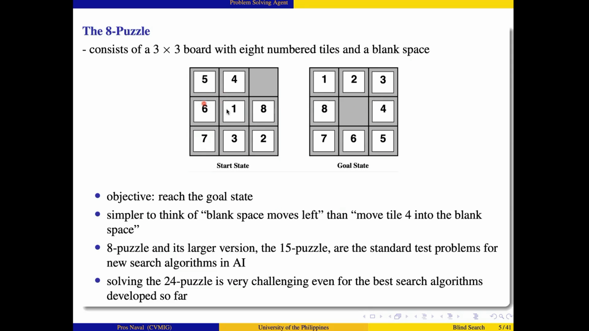

*"So the starting state looks like this, for example"* [00:07:18] — he points at the left board; the goal state is well-defined (it could be any configuration you choose, but it is fixed) [00:07:18]. A representational trick that recurs all lecture: **it is simpler to think of the *blank space* moving left/right/up/down than of a numbered tile moving into the blank** [00:07:50] — you track one blank instead of eight tiles.

**Exam hook:** the 8-puzzle and its larger version, the **15-puzzle** (4×4), *"are the standard test problems for new search algorithms in AI"*; the 5×5 **24-puzzle** *"is very challenging even for the best search algorithms developed so far"* [00:08:25] — *"and we shall see why"* (the exponential complexity results of §A.8).

### A.2.2 The 8-queens problem [00:08:57]

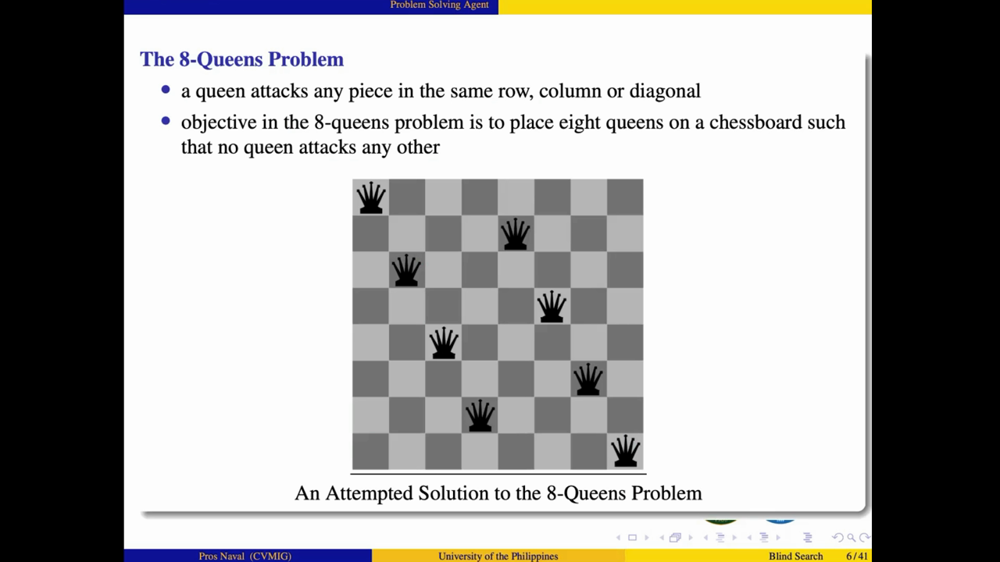

Place eight queens on a standard chessboard so that **no queen attacks any other**; a queen attacks any piece in the **same row, column, or diagonal** [00:08:57].

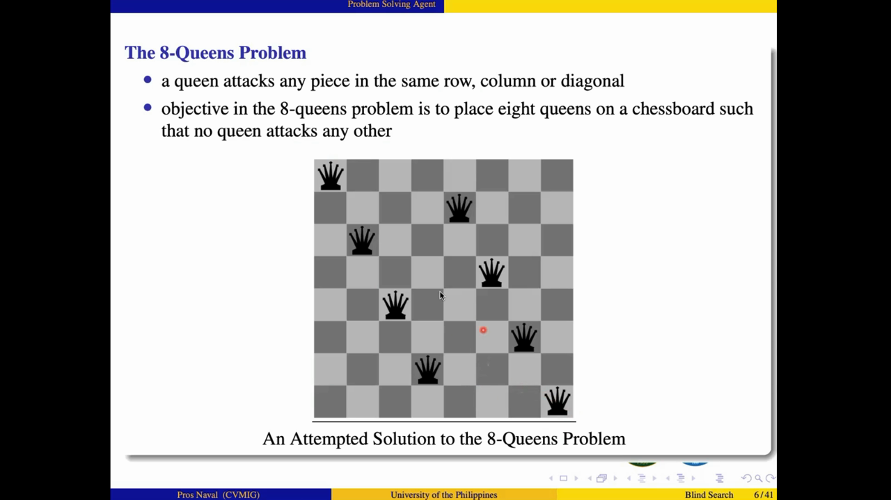

The slide's board is captioned *"An Attempted Solution"* deliberately: *"Actually, it doesn't solve the problem because these two queens are attacking each other… you have not yet reached your goal"* [00:09:32]. (On the slide, every row and column is distinct, but the queens at the two corners — top-left and bottom-right — share the long diagonal.)

### A.2.3 The route-finding problem [00:10:07]

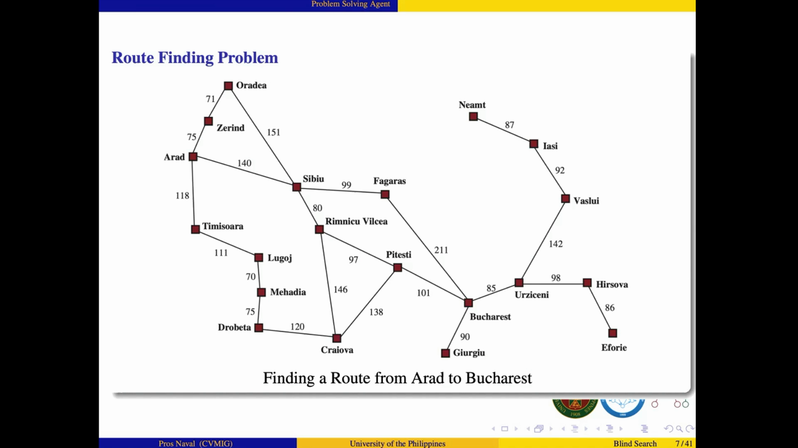

A map of Romania's cities; find a route from **Arad to Bucharest** [00:10:07]. You are given the inter-city distances in kilometers (this map is the running example for the rest of Lecture 3 — memorize its shape; the full edge list is in §A.5).

**Exam hook:** *"Google Maps uses this algorithm… the main algorithm is called A-star"* [00:10:43] — with enhancements, but *"even the original version of A star is already very useful"* [00:11:32]. A\* is **the subject of the next lecture (3B)**; today we solve the same map *without* the distance information.

### A.2.4 The blocks world [00:12:07]

A toy problem *"important for **planning**"* — achieving several goals through a series of action sequences [00:12:07]. The world: **numbered blocks that can be stacked into a tower of unlimited height**; the goal is to stack them in a specified order (1, 2, 3, … or 2, 4, 6, …) using a robot arm [00:12:39]. It is not simple, because in the initial state some blocks sit on top of others; the algorithm must *"use logic and search"* to achieve the goal, and this requires planning [00:13:24]. It led to **Sussman's anomaly**, *"where sub-goals actually interact"* [00:13:24] — flagged here, treated in the planning lectures.

## A.3 Problem types [00:13:24]

Four types of problems: **single-state, multiple-state, contingency, and exploratory** [00:13:24]. The lecture develops the first two on a purpose-built toy world.

### A.3.1 The vacuum world [00:14:35]

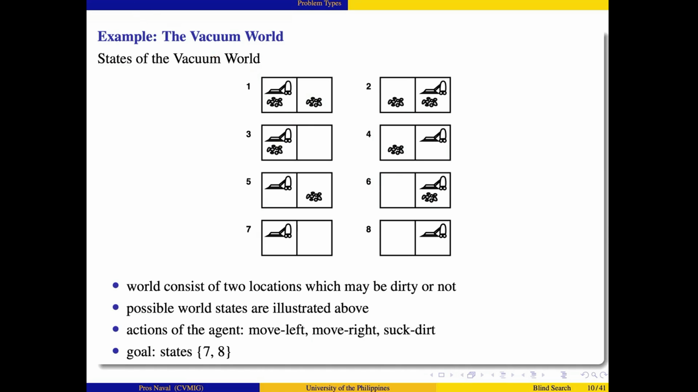

*"A super simplistic world with only two cells"* [00:14:35]: a left room and a right room, each dirty or clean, plus a vacuum-cleaner agent. That yields exactly **eight world states** [00:15:38]:

| State | Left cell | Right cell |
|---|---|---|
| 1 | vacuum + dirt | dirt |
| 2 | dirt | vacuum + dirt |
| 3 | vacuum + dirt | clean |
| 4 | dirt | vacuum (clean) |
| 5 | vacuum (clean) | dirt |
| 6 | clean | vacuum + dirt |
| 7 | **vacuum, all clean** | clean |
| 8 | clean | **vacuum, all clean** |

- **Actions (3):** `move-left`, `move-right`, `suck-dirt` [00:16:12]. Moving left from the left room does nothing — you stay put [00:16:12].
- **Goal: states {7, 8}** — everything clean, from any starting state [00:15:05].

### A.3.2 Single-state problem [00:16:48]

The agent **(1) knows exactly which state it is in** — the world is fully accessible/observable — and **(2) knows exactly the effects of its actions** [00:16:48]. (If the sensors do *not* give enough information, the problem becomes **partially observable** [00:17:23] — that is the next type.)

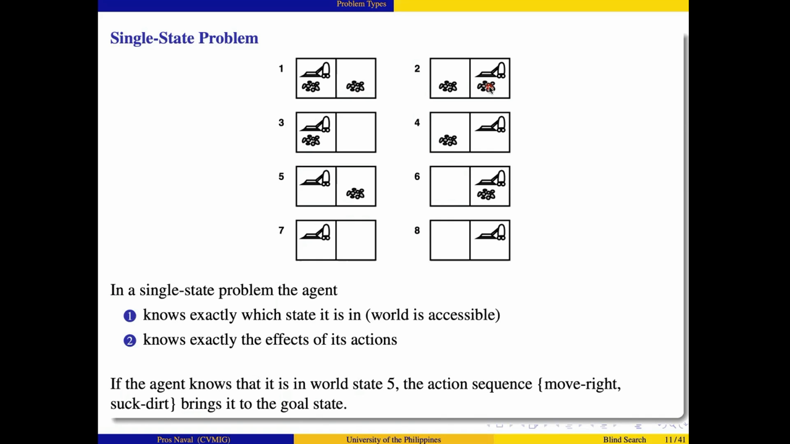

Worked from the slide: from **state 5**, the sequence `{move-right, suck-dirt}` brings you to the goal [00:18:32]; from another start, *"suck dirt, move left, suck dirt, then you're now in state seven, which is your goal state"* [00:18:32].

**The punchline ties back to Lecture 1's Laws 4/5** [00:19:05]:

> *"Since there's complete knowledge, there's no more search to be done… If you have complete knowledge, you don't do any search at all. If you have very little knowledge, you'll compensate that by doing more search."* [00:19:05]

With full knowledge there is a **predefined action sequence** for every state — *"let's just have a lookup table"* [00:19:43]. No searching.

### A.3.3 Multiple-state problem [00:20:18]

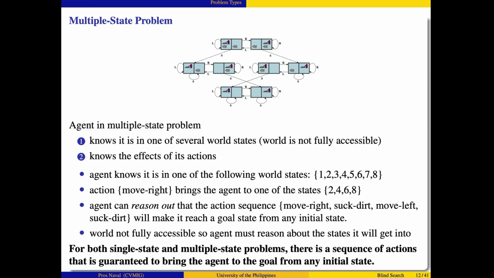

Now the sensors are inadequate — **partial observability**: the agent only *"knows that it is in one of several world states"*, though it still knows the effects of its actions [00:20:18]. The vacuum agent with no sensors starts believing it is in **{1,2,3,4,5,6,7,8}** [00:20:50]. Then, pointing at the belief-state transitions on the slide: *"the action move right will bring the agent to one of the states, 2, 4, 6, 8"* [00:21:21]. The agent can **reason out** (no sensing needed!) that

> `{move-right, suck-dirt, move-left, suck-dirt}` reaches a goal state **from any initial state** [00:21:21].

Little knowledge → compensate by reasoning/more actions [00:21:51]. The boxed takeaway on the slide, spoken verbatim: **"For both single-state and multiple-state problems, there is an action sequence that is guaranteed to bring the agent to the goal from any initial state"** [00:22:28].

### A.3.4 Contingency problem [00:22:28]

Here *"the correct action sequence depends on a possible contingency that might arise during execution"* [00:22:28]. The lecture's example is **car driving** [00:23:05]: even knowing the way, *"traffic conditions, accidents, people crossing the street… could alter our planned route"* [00:24:09]. His personal aside: when learning to drive he was told *"every time you go out driving, you're learning… anything could happen"* [00:23:39].

> **Contingency problems require interleaving of search and execution** [00:24:09] — *"or more properly, sensing, searching, and execution. It's a loop. Sense, search, execute. Sense, search, execute."* [00:24:45]

**Games can be modeled as contingency problems** *"because your opponent is there to defeat you"* [00:25:16] — the hook for Lecture 3C.

### A.3.5 Exploratory problem [00:25:16]

The agent is **ignorant of the effects of its own actions** and *"must experiment in the real world to gain experience"* to exploit in later problems [00:25:49] — *"just like what newborn babies do"* [00:26:23]. This is **exploration and exploitation** [00:26:23]. **Reinforcement learning attempts to solve exploratory problems** [00:26:53]; the **multi-armed bandit problem** — a special case of RL — isolates the exploration-vs-exploitation trade-off [00:26:53].

| Type | Knows its state? | Knows action effects? | What's needed |
|---|---|---|---|
| Single-state | exactly | exactly | lookup table, no search |
| Multiple-state | one of several (belief set) | yes | reasoning over belief states |
| Contingency | contingencies arise mid-execution | — | interleave sense–search–execute |
| Exploratory | — | **no** | experiment (RL) |

## A.4 Anatomy of a search problem [00:27:30]

A search problem consists of four components [00:27:30]:

1. **State space** — initial state, goal state(s), and all other possible states [00:27:30]
2. **Operators** — the set of possible actions available to the agent [00:28:05]
3. **Goal test** — after each action, *has the goal been reached?* [00:28:05]
4. **Path cost** — a function assigning a cost to a path; the agent *"would not want to waste its time and resources"* [00:28:39]

### A.4.1 Formulating the 8-puzzle [00:29:13]

| Component | 8-puzzle formulation |
|---|---|
| **States** | a description specifying *the location of each of the 8 tiles in one of the 9 squares* — *"basically a representation that mimics the arrangement of the tiles… as is"* [00:29:13] |
| **Operators** | **blank** moves left, right, up, or down [00:29:47] |
| **Goal test** | does the state match the goal configuration? [00:30:30] |
| **Path cost** | each move costs 1 → path cost = **length of the path** [00:31:02] |

Not every move is always legal: with the deck's start state (blank at top-right), *"moving up is not allowed… moving right is also not allowed. So you only have two choices, move left or move down"* [00:29:47].

### A.4.2 Formulating the 8-queens — two formulations [00:31:34]

- **Incremental formulation**: place queens **one by one**, each time ensuring the new queen is not attacked [00:31:34]. One version — *States:* arrangements of 0–8 queens with none attacked; *Operators:* place a queen in the **leftmost empty column** unattacked [00:32:09]. (Only one possible incremental formulation among many [00:32:45].)
- **Complete-state formulation**: put **all eight queens on the board** and move them around — *Operators:* move any **attacked** queen to another square in the **same column** [00:32:09] — until, *"after some time, hopefully,"* none attack [00:33:16].

For **both**: *Goal test* = 8 queens on board, none attacked; *Path cost* = **zero**, *"because we are only interested in the final state. But the **search cost** is important"* — how many moves the search itself makes [00:33:16].

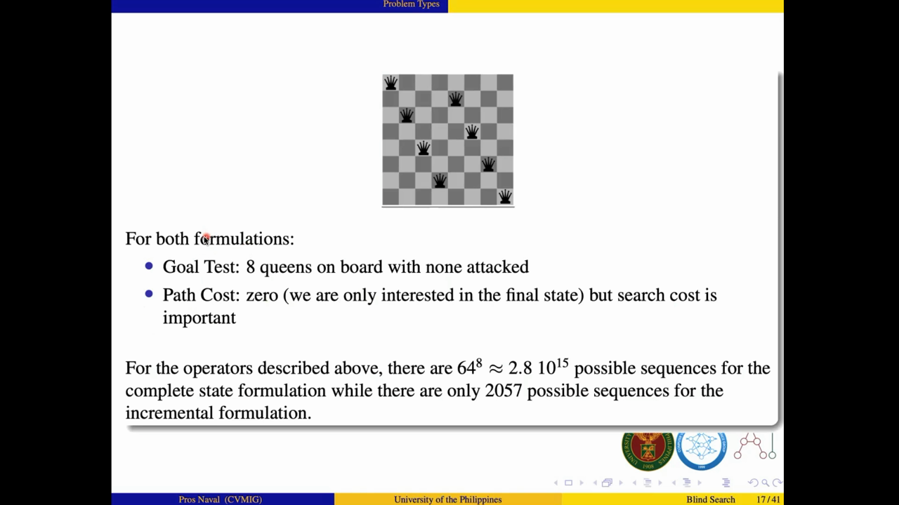

The payoff, pointed at on the slide: *"there are 2.8 times 10 to the 15 possible sequences for the complete state formulation, while there are only 2,057 possible sequences for the incremental formulation… the incremental formulation is obviously much better"* [00:33:54]. **How you formulate the problem changes the size of the search space by 12 orders of magnitude.**

> ⚠ Outside the lecture: the slide prints 64⁸ ≈ 2.8·10¹⁵, but 64⁸ is actually ≈ 2.8×10¹⁴ — the exponent looks off by one. The comparison (quadrillions vs ~2,000) is unaffected.

### A.4.3 Other important terms [00:34:32]

> Given a state *x*, the **successor function** *S(x)* *returns the set of states reachable from x by any single action* [00:34:32].

- **State space** — the set of *all* states reachable from the initial state by *any sequence of actions* [00:34:32].
- **Path** — any sequence of actions leading from one state to another [00:35:02].
- **Goal** — a set of goal states *or an abstract description*; in chess the goal is *checkmate: the opponent's king can be captured on the next move no matter what the opponent does* — so many configurations *"that it is not practical to enumerate them"* [00:35:02]. (This detail returns to bite bidirectional search in §A.13.)

## A.5 Searching for solutions: growing the search tree [00:35:33]

> A **solution** is *a path from the initial state to a state that satisfies the goal test* [00:35:33].

The **effectiveness of a search** is measured by four criteria [00:36:04]:

| Criterion | Question |
|---|---|
| **Completeness** | does it find a solution when there is one? [00:36:04] |
| **Optimality** | does it find the lowest possible path cost? [00:36:35] |
| **Time complexity** | cost in time to arrive at the solution [00:37:09] |
| **Space complexity** | cost in memory to arrive at the solution [00:37:09] |

Once a problem is defined — initial state, operators (via successor function), goal test, path cost — *"the solution can now be found by a search through search space"* [00:37:09].

### A.5.1 Blind means: no distances [00:37:47]

Back to Arad → Bucharest [00:37:47] — with a twist: *"for this part of the lecture, the blind search part, **we are not given this information**"* — no straight-line distances, *"no GPS information nor a map"* [00:38:22]. He points at the very distance numbers being withheld. Can we still solve it? *"Yes, definitely. But… if you have less knowledge, you need to compensate that by doing more search"* [00:38:22].

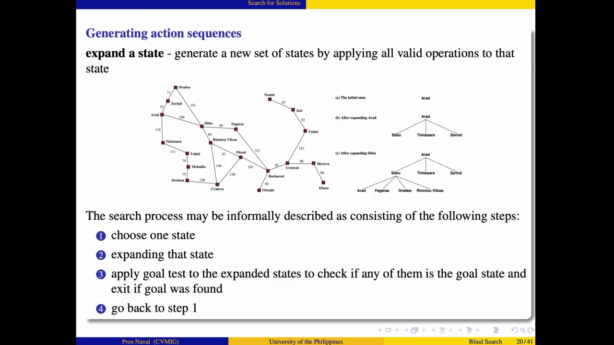

The full state space (20 cities; distances shown on the slide but unused by blind search):

| Edge | km | Edge | km | Edge | km |
|---|---|---|---|---|---|
| Oradea–Zerind | 71 | Sibiu–Fagaras | 99 | Bucharest–Giurgiu | 90 |
| Zerind–Arad | 75 | Sibiu–Rimnicu Vilcea | 80 | Bucharest–Urziceni | 85 |
| Oradea–Sibiu | 151 | Rimnicu Vilcea–Pitesti | 97 | Urziceni–Vaslui | 142 |
| Arad–Sibiu | 140 | Rimnicu Vilcea–Craiova | 146 | Urziceni–Hirsova | 98 |
| Arad–Timisoara | 118 | Craiova–Pitesti | 138 | Hirsova–Eforie | 86 |
| Timisoara–Lugoj | 111 | Pitesti–Bucharest | 101 | Vaslui–Iasi | 92 |
| Lugoj–Mehadia | 70 | Fagaras–Bucharest | 211 | Iasi–Neamt | 87 |
| Mehadia–Drobeta | 75 | Drobeta–Craiova | 120 | | |

### A.5.2 Expanding states [00:38:58]

> To **expand a state** = *generate a new set of states by applying all valid operators to that state* [00:38:58].


*"We are here in Arad. So from here, there are only three possible actions"* [00:39:35] — go to **Sibiu, Timisoara, or Zerind**. Choose Sibiu; from there four options: back to **Arad** (*"that's not a good plan"* — but still a possible option, so it goes in the tree [00:40:38]), **Oradea**, **Fagaras**, **Rimnicu Vilcea** [00:40:05].

The search process, informally [00:41:14]:

1. **Choose** one state
2. **Expand** it — generate all successors [00:41:44]
3. **Goal-test** the expanded states — *"have I reached my goal? Not yet"* [00:41:44] — exit if found
4. Go back to step 1

Which of the three to choose? *"It depends on the algorithm. It's the algorithm basically that tells us which of these should I choose"* [00:42:19].

### A.5.3 The search tree [00:42:51]

*"As you can see, this builds a **search tree**"* [00:42:51]. (His aside to this engineering-heavy class: trees are bread-and-butter for CS people, while *"engineers typically… deal with arrays… tensors"* [00:42:51]–[00:43:28] — so he builds it up slowly.)

```
                     Arad                        ← root = search node (initial state)
          ┌───────────┼───────────┐
        Sibiu     Timisoara     Zerind           (b) after expanding Arad
   ┌─────┼─────────┬─────────┐
  Arad Fagaras  Oradea  Rimnicu Vilcea           (c) after expanding Sibiu
```

- A **search tree is built during search**; its **root is the search node**, corresponding to the initial state [00:43:28].
- When choosing an action, **take note of the other options** so we can **backtrack** *"in case our choice does not lead us to a solution"* [00:44:01].
- The choice of which state to expand next *"is dictated by the **search strategy**"* [00:44:32].
- **Leaf nodes** = states with no successors in the tree — *either not yet expanded, or expanded but generated an empty set* [00:44:32]. A dead end: *"if you have reached that, go back"* [00:45:08]. Since you memorize visited places (*"I've seen this city before, so I won't visit that again"*), a repeated city also becomes a leaf [00:45:08].
- **A search algorithm chooses one unexpanded leaf node to expand** [00:45:38] — he pairs each expansion step with its partial tree on the slide [00:45:38], until *"the solution is here… you have reached your goal"* [00:46:11].

Each node corresponds to a state; here there are **20 states since there are 20 cities** [00:46:11]. But in general **the number of nodes of a search tree is infinite**, because the number of *paths* in state space is infinite once looping is included [00:46:43] — a state space is finite; the tree over it need not be.

## A.6 The general search algorithm and its data structures [00:47:17]

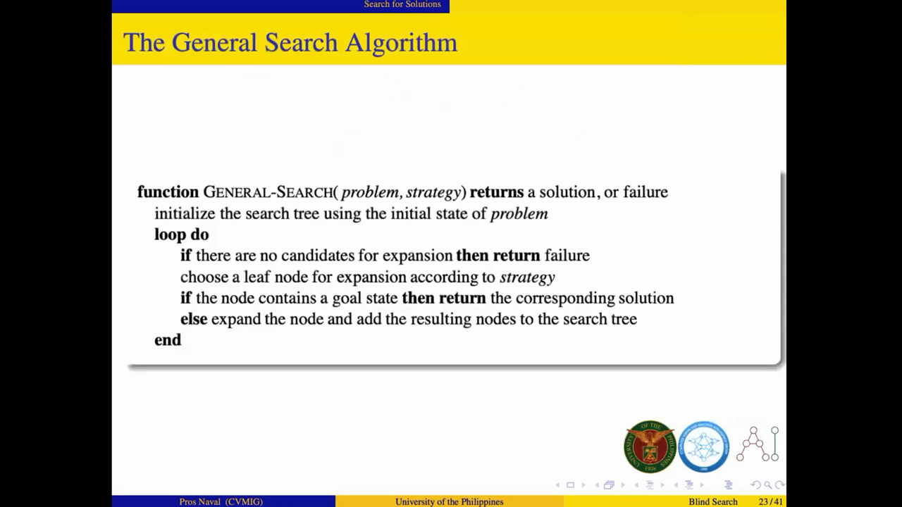

```
function GENERAL-SEARCH(problem, strategy) returns a solution, or failure
    initialize the search tree using the initial state of problem
    loop do
        if there are no candidates for expansion then return failure
        choose a leaf node for expansion according to strategy
        if the node contains a goal state then return the corresponding solution
        else expand the node and add the resulting nodes to the search tree
    end
```

It *"either finds a solution or it doesn't"* — and the solution it returns may be *"a great solution, a bad solution, but a solution nonetheless — a suboptimal solution if you wish"* [00:47:49]. One node already counts as an initialized tree [00:47:49]. Adding resulting nodes to the tree implies we can *"backtrack, or memorize rather, the path — because we need to execute the action sequence"* at the end [00:48:24].

### A.6.1 The node data structure [00:49:03]

A search-tree **node** stores five components [00:49:03]:

| # | Component | Meaning |
|---|---|---|
| 1 | **state** | the state in state space this node corresponds to |
| 2 | **parent node** | the node that generated this one |
| 3 | **operator** | the action applied to generate it (*"that was the action that put me in this particular state"* [00:49:33]) |
| 4 | **depth** | number of nodes on the path from root to this node [00:49:33] |
| 5 | **path cost** | cost of the path from the initial state to this node [00:50:04] |

An **EXPAND function** *"takes care of calculating each of these components… puts it into the appropriate bins"* [00:50:04].

### A.6.2 The fringe is a queue [00:50:34]

> The **fringe** (or **frontier**) = *the collection of nodes waiting to be expanded* — *"best implemented as a queue for efficiency"* [00:50:34].

Expand Arad → its three successors go into the queue, *"and it is the strategy that will dictate which of the three will be expanded next"* [00:51:12]. Queue operations [00:51:45]:

- `MAKE-QUEUE(Elements)` — creates a queue with the given elements
- `EMPTY?(Queue)` — true only if no elements remain
- `REMOVE-FRONT(Queue)` — removes and returns the front element
- `QUEUING-FN(Elements, Queue)` — inserts elements into the queue; **how is dictated by the search algorithm** [00:52:17]

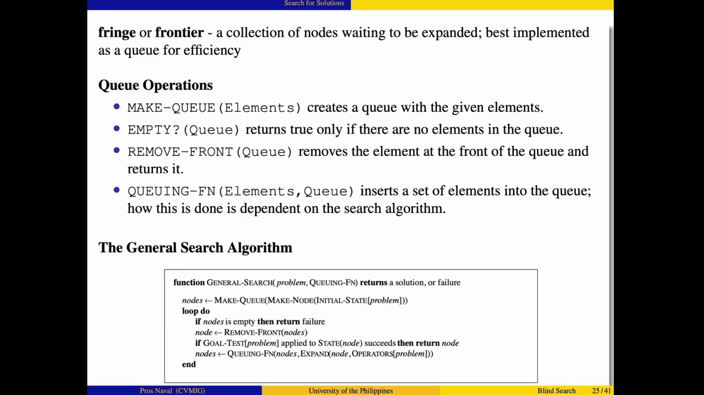

*"Now our general search algorithm is taking shape"* [00:52:47]:

```
function GENERAL-SEARCH(problem, QUEUING-FN) returns a solution, or failure
    nodes ← MAKE-QUEUE(MAKE-NODE(INITIAL-STATE[problem]))
    loop do
        if nodes is empty then return failure
        node ← REMOVE-FRONT(nodes)
        if GOAL-TEST[problem] applied to STATE(node) succeeds then return node
        nodes ← QUEUING-FN(nodes, EXPAND(node, OPERATORS[problem]))
    end
```

Walkthrough [00:52:47]–[00:55:06]: make a node from the initial state (your 8-puzzle board configuration), make a one-node queue; loop — empty queue means *"there's no more node to process, so failure"* [00:53:49]; otherwise `REMOVE-FRONT`, goal-test it (*"the agent has reached its goal… return the node"* [00:54:21]), else expand and hand the results to the queuing function, which *"rearranges the queue"* [00:55:06]. **Every blind strategy below is this one algorithm with a different QUEUING-FN.**

## A.7 Evaluation criteria, and blind vs. heuristic search [00:55:39]

The four criteria, restated as the official yardstick [00:55:39]:

1. **Completeness** — guaranteed to find a solution when there is one?
2. **Time complexity** — how long to find it? [00:56:11]
3. **Space complexity** — how much memory? [00:56:11]
4. **Admissibility (Optimality)** — the highest-quality solution when there are several? [00:56:11]

**Exam hook:** *"these are the evaluation criteria against which we will compare the different search algorithms"* [00:56:11] — they are literally the rows of the final table (§A.14).

Two general classes of search strategies [00:56:48]:

| | Blind (uninformed) | Heuristic (informed) |
|---|---|---|
| Information about steps/path cost to goal | **none** [00:56:48] | problem-specific knowledge [00:57:55] |
| Choice of node to expand depends on | **only the node's position in the search tree** [00:57:19] | the added knowledge |
| Consequence | more search | *"more knowledge, less search… more efficient searching"* [00:57:55] |
| Examples | BFS, DFS, uniform cost, depth-limited, iterative deepening, bidirectional [00:57:19] | greedy, A\*, IDA\*, SMA\*, RTA\*, LRTA\*, B\* [00:58:30] |

Being blind is the no-GPS case [00:56:48]. Of the heuristic list, the course covers greedy, A\*, and IDA\* [00:58:30] — Lecture 3B.

## A.8 Blind search 1 — Breadth-First Search (BFS) [00:59:00]

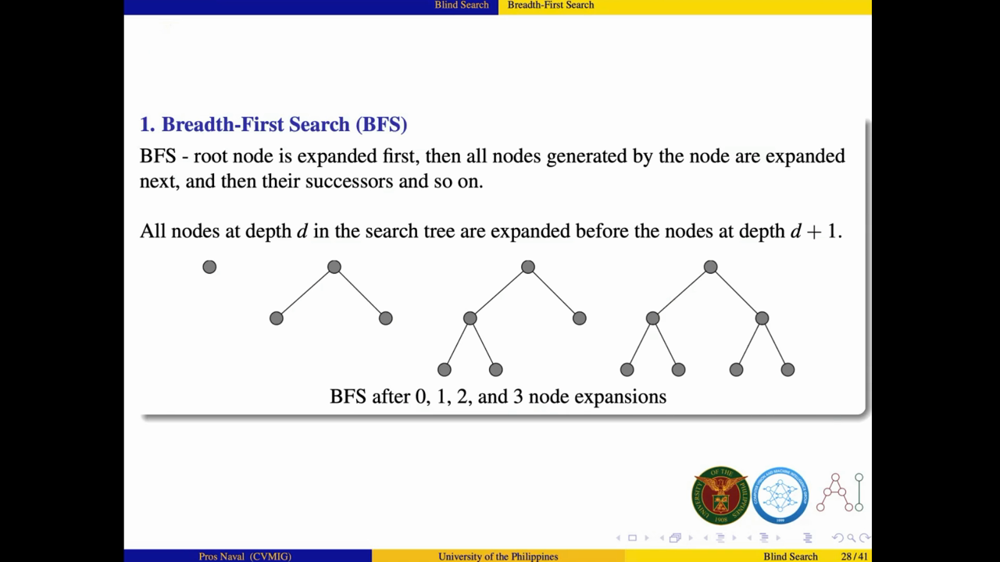

> In BFS, **the root node is expanded first, then all nodes generated by it, then their successors, and so on** — *all nodes at depth d are expanded before the nodes at depth d+1* [00:59:38].

On the demo binary tree (branching factor 2, for simplicity [00:59:00]):

```
 After 0:    ●            After 1:      ●          After 2:      ●          After 3:      ●
                                       ╱ ╲                      ╱ ╲                      ╱ ╲
                                      ●   ●                    ●   ●                    ●   ●
                                                              ╱ ╲                      ╱ ╲ ╱ ╲
                                                             ●   ●                    ●  ● ●  ●
```

**Implementation:** call GENERAL-SEARCH with a queuing function that **puts newly generated states at the END of the queue** [01:00:43]. Working through the figure: after expanding a node, its children queue up *behind* the other node at the same depth, *"which means this one first before you process this"* [01:01:13] — the sibling is expanded ahead of the children, forcing level-by-level order.

**Properties** [01:01:47]:

- **Complete** — *"if there is a solution then BFS is guaranteed to find it… because it actually looks at all the nodes at the same level"* [01:01:47].
- **Shallowest goal found first; optimal provided the path cost is a non-decreasing function of depth** [01:02:20]. Why: when each node is expanded, the goal test is performed — *"is this the solution? no. is this a solution? no. then expand this"* [01:03:22] — so a shallow solution is found before any deeper one [01:03:22].

**Complexity** [01:03:55]: if each expansion yields *b* new states, *b* is the **branching factor** (binary tree: b = 2). Goal at depth *d* → maximum nodes expanded before finding a solution:

> 1 + b + b² + b³ + … + b^d  [01:04:30]

So **time O(b^d) and space O(b^d) — both exponential** [01:05:11].

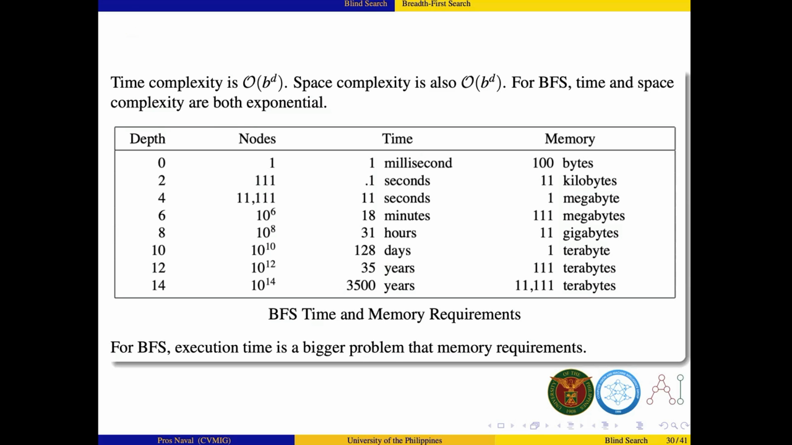

With b = 10, 1 ms per node, 100 bytes per node [01:05:53]:

| Depth | Nodes | Time | Memory |
|---:|---:|---:|---:|
| 0 | 1 | 1 millisecond | 100 bytes |
| 2 | 111 | 0.1 seconds | 11 kilobytes |
| 4 | 11,111 | 11 seconds | 1 megabyte |
| 6 | 10^6 | 18 minutes | 111 megabytes |
| 8 | 10^8 | 31 hours | 11 gigabytes |
| 10 | 10^10 | 128 days | 1 terabyte |
| 12 | 10^12 | **35 years** | 111 terabytes |
| 14 | 10^14 | 3500 years | 11,111 terabytes |

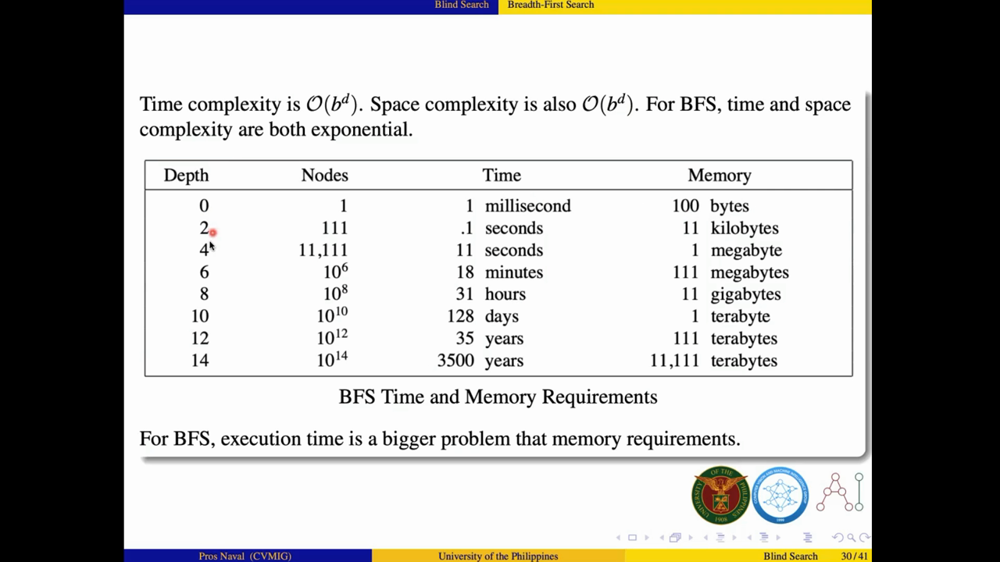

*"So if it's two, four, and so on, you have these values"* [01:05:53] — and then the argument he builds on the depth-12 row [01:06:25]: *"Can you wait for 35 years before you get the solution? I cannot. But I can spend more money if I'm desperate"* — buy hard drives, store the data; memory is merely expensive. *"But 35 years is 35 years"* [01:06:58]. Even parallelism barely helps: with 100 computers and roughly linear scaling, *"10 years is still a long time"* [01:07:35].

> **Exam hook:** *"For BFS, execution time is a bigger problem than the memory requirement"* [01:07:35] — you can buy memory; you cannot buy time.

## A.9 Blind search 2 — Uniform Cost Search (Dijkstra, 1959) [01:07:35]

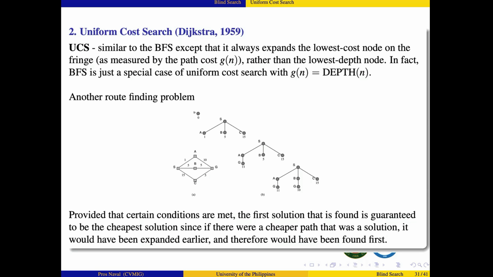

> **UCS** (Dijkstra, 1959) is *similar to BFS except that it always expands the **lowest-cost node on the fringe**, as measured by the path cost g(n), rather than the lowest-depth node* [01:07:35]. **BFS is just a special case of UCS with g(n) = DEPTH(n)** [01:08:19].

The slide's mini route problem (S = start, G = goal):

```
            A
        1 ╱   ╲ 10
         S──B──G        S–B = 5, B–G = 5
       15 ╲   ╱ 5       (B sits on the straight S–G line)
            C
```

UCS snapshots (g printed under each node): expand S → A(1), B(5), C(15); expand A (cheapest) → G via A = 11; expand B (5) → **G via B = 10** — the cheaper goal surfaces before the g=11 goal is accepted. *"Provided certain conditions are met, the first solution found is guaranteed to be the cheapest: if there were a cheaper path that was a solution, it would have been expanded earlier and found first"* [01:08:19].

**The condition** [01:08:49]: UCS finds the cheapest solution if the cost of a path **never decreases** along the path,

> g(SUCCESSOR(n)) ≥ g(n) for every node n

— which holds *"if every operator has a non-negative cost"* [01:08:49]. Then UCS finds the cheapest path **without exploring the whole search tree** [01:09:23]. Time and space complexity: still **O(b^d)** for both, the same as BFS [01:09:23]. (The transcript's "same as that of DFS" is a slip of the tongue — the slide and the comparison compare it to BFS's O(b^d).)

## A.10 Blind search 3 — Depth-First Search (DFS) [01:09:23]


> **DFS expands one of the nodes at the deepest level of the tree.** When the search hits a non-goal node with no expansions, it goes back and expands nodes at shallower levels [01:09:23].

The figure's binary tree *"keeps on going deeper and deeper until it hits the leaf nodes… only then will it go to the next node"* [01:10:01]. Note the memory trick he points at: *"this part here was **pruned**… Since we know that none of this will be important anymore towards finding the solution, you can save memory by getting rid of this"* — and reuse that memory for the next expansions [01:10:01].

**Implementation:** a queuing function that **puts newly generated states at the FRONT of the queue** [01:10:34] — *"the BFS is the opposite"* (end of queue).

**Space** [01:11:09]: DFS stores only the path from root to the current leaf **plus the remaining unexpanded siblings** of each node on that path. For branching factor *b* and maximum tree depth *m*, the required storage is per slide 34 *b^m* nodes [01:11:41] — but note the final comparison table (slide 41) records DFS space as **O(bm)**, the linear figure that the path-plus-siblings description actually implies; treat the slide-34 superscript as a typo caught by the deck itself.

**Time** [01:11:41]: **O(b^m)** — *but on average DFS performs better than BFS*, since BFS must look at all nodes at depth d−1 before any node at depth d [01:11:41].

**The two failure modes:**

1. **May never terminate** — with infinite-depth trees, *"it will just keep on expanding nodes forever"* [01:12:18], *"and ever and ever… but there's actually a solution here. Therefore it is not complete"* [01:13:52].
2. **May return a longer-than-optimal solution**, finding a deep goal even when a shallow one exists [01:12:18].

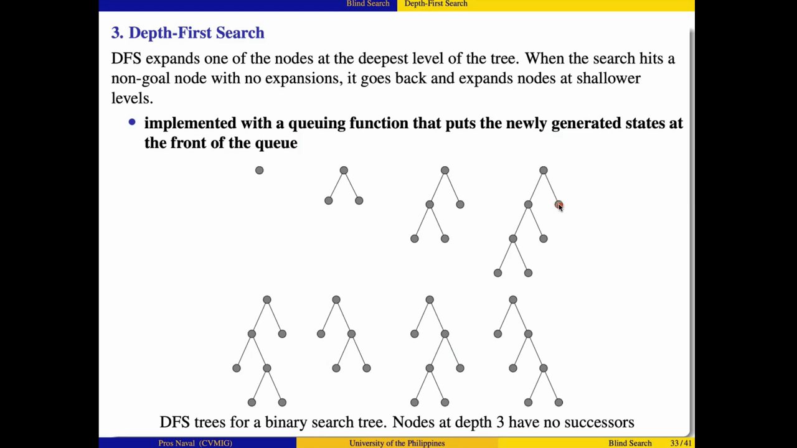

The worked example, pointed at on the tree [01:12:51]: two goal nodes — one at path length 1, one at path length 3. *"Obviously, this is a better solution because you only need this much resources"* [01:12:51]. But since DFS is busy expanding down the deep branch, it goal-tests the deep solution first and *"this will be returned as the solution — [when] in fact there's a better solution"* [01:13:21].

> **DFS is neither complete nor optimal** [01:13:52]. **Exam hook:** *"We must avoid using DFS for search trees with large or infinite maximum depths"* [01:14:28].

## A.11 Blind search 4 — Depth-Limited Search [01:14:28]

*"Is DFS hopeless or useless? Not exactly"* [01:14:28] — **depth-limited search (DLS)** is *the same as DFS but with a cut-off on the maximum depth of a path* [01:14:28]. For the route-finding problem: *"there are five cities before we reach the goal, so therefore I can assign a cutoff of four steps"* [01:15:06].

| Property | DLS | Why |
|---|---|---|
| Complete | **Yes, if depth limit ℓ ≥ depth of solution** [01:15:38] | the cutoff kills the infinite descent |
| Optimal | **No** — same reason as DFS [01:15:38] | can still find a deep goal first within the limit |
| Time | **O(b^ℓ)** [01:15:38] | |
| Space | **O(bℓ)** [01:15:38] | path + siblings, now bounded |

Careful reading: time is *b to the power ℓ*, space is *b times ℓ* — easy to conflate by ear.

## A.12 Blind search 5 — Iterative Deepening Search (Slate & Atkin, 1977) [01:15:38]

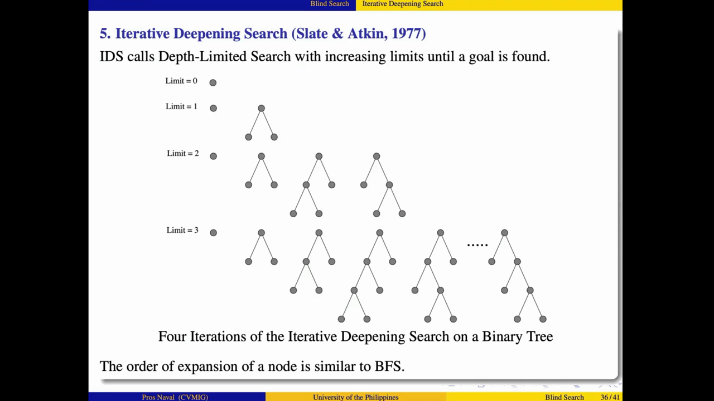

> **IDS calls depth-limited search with increasing limits until a goal is found** [01:16:15].

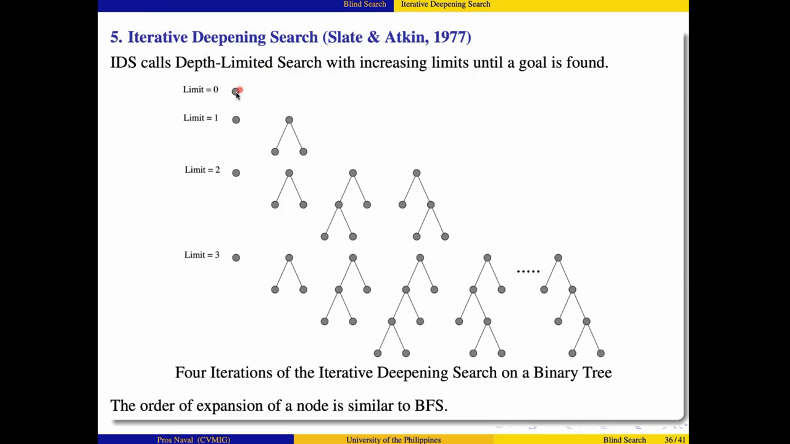

*"So here you set the limit to zero, you set the limit to one. By setting the limit to one, you are forced to examine the nodes on the same level — level 1 and level 2, level 3 and so on. Therefore it will find the solution when there is a solution"* [01:16:15]. Watching how nodes get expanded, *"it's like that of a BFS"* [01:17:00] — depth-first mechanics, breadth-first visiting order.

```
Limit 0:  ●
Limit 1:  ●  →  ●╱╲●                         (restart from scratch each round)
Limit 2:  ●  →  ●╱╲●  →  expand level 2 …
Limit 3:  ●  →  ●╱╲●  →  … → expand level 3
```

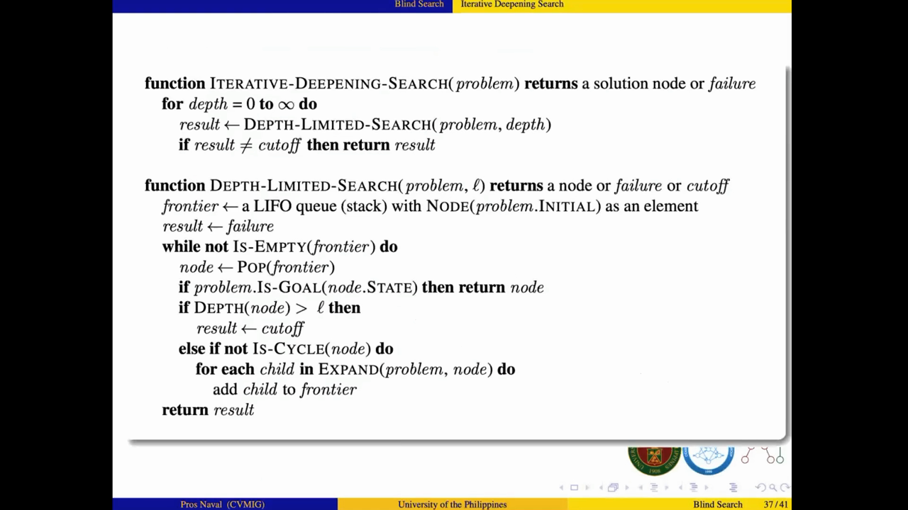

The slide shows the two-function implementation — a `for depth = 0 to ∞` loop returning as soon as DLS's result ≠ *cutoff*, over a LIFO-stack DLS with a cycle check. *"This is very familiar to those who have done data structures, so it should be easy to implement"* [01:17:00].

**Properties** [01:17:32]:

- **Complete** — finds a solution no matter how deep it is.
- **Optimal** — the shallowest solution is always found. *"The depth limit is the one that saves the day, making the depth-limited search complete and optimal"* [01:17:32].

**The re-expansion objection, answered** [01:18:04]: yes, for limit 2 you re-expand everything you expanded at limit 1 — *"I've already expanded these nodes in the previous iteration. Why should I do that again?"* But that overhead *"is actually small, especially for a tree with a high branching factor — and even for a binary tree with branching factor of just two, **IDS only takes twice as long as a complete BFS**"* [01:18:04]–[01:18:38]. (Intuition: the bottom level dominates an exponential sum, so repeating the shallow levels is cheap.)

**Complexity** [01:18:38]: time **O(b^d)**, space **O(bd)** for a solution at depth d — BFS's completeness and optimality at DFS-style linear memory.

> **Exam hook:** *"Iterative deepening search is the **preferred search method when there is a large search space and the depth of the solution is unknown**… for blind search, this is very much recommended"* [01:19:11].

## A.13 Blind search 6 — Bidirectional Search (Pohl, 1969) [01:19:11]

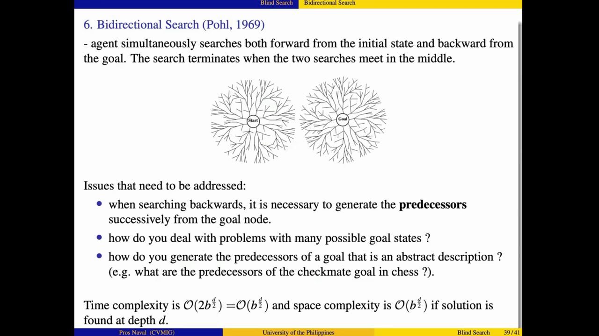

The agent is given both the start and the goal state, and **simultaneously searches forward from the initial state and backward from the goal**; *"the search terminates when the two searches meet in the middle"* [01:19:44].

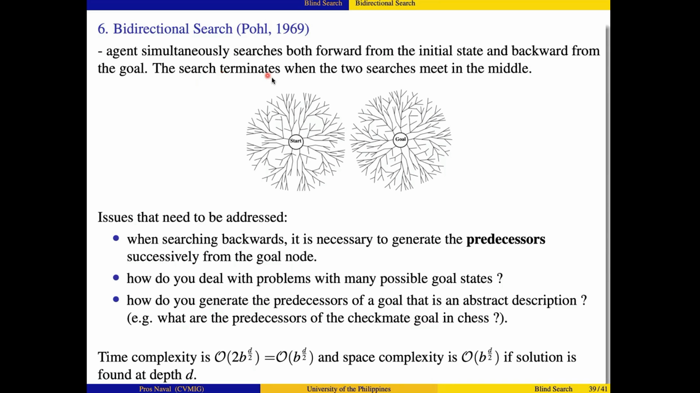

```
        ( forward tree )  ( backward tree )
       Start ───▶ ・・・ ✕ ・・・ ◀─── Goal
                radius ≈ d/2 each side
```

*"It looks nice. But there are issues that need to be addressed"* [01:19:44]:

- **Searching backwards requires generating predecessors** successively from the goal state [01:20:15] — forward we know how to do; backward is the problem.
- **Many goal states** — which one do you grow the backward tree from? [01:20:48]
- **Abstract goal descriptions** — *"what are the predecessors of a checkmate goal in chess?"* There are so many checkmate configurations that this is impractical: *"chess is definitely not one where we would like to use bidirectional search"* [01:20:48]–[01:21:21].

**Complexity** (slide 39; the spoken version garbles the exponents): time **O(2b^{d/2}) = O(b^{d/2})**, space **O(b^{d/2})** for a solution at depth d [01:21:21]. The whole win: two half-depth exponentials, b^{d/2} + b^{d/2}, are vastly smaller than one full-depth b^d.

The deck also carries a full BiBF-SEARCH pseudocode slide (slide 40) — two priority-queue frontiers with `reached` tables and a `PROCEED` step that checks each child against the *other* direction's reached set — shown as "this is how it looks like" [01:21:53] without a walkthrough; skim it for structure, not for memorization.

## A.14 Comparison of blind search strategies [01:21:53]


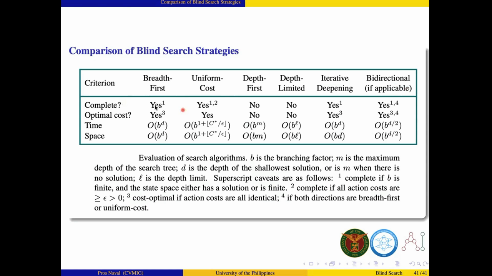

*"Which one is complete? BFS, UCS, and iterative deepening search"* [01:22:25] — and the same three are the yes-answers for optimal cost [01:22:25]. The full slide table:

| Criterion | Breadth-First | Uniform-Cost | Depth-First | Depth-Limited | Iterative Deepening | Bidirectional (if applicable) |
|---|---|---|---|---|---|---|
| **Complete?** | Yes¹ | Yes¹,² | No | No | Yes¹ | Yes¹,⁴ |
| **Optimal cost?** | Yes³ | Yes | No | No | Yes³ | Yes³,⁴ |
| **Time** | O(b^d) | O(b^(1+⌊C\*/ε⌋)) | O(b^m) | O(b^ℓ) | O(b^d) | O(b^(d/2)) |
| **Space** | O(b^d) | O(b^(1+⌊C\*/ε⌋)) | O(bm) | O(bℓ) | O(bd) | O(b^(d/2)) |

Symbols (slide caption): **b** = branching factor; **m** = maximum depth of the search tree; **d** = depth of the shallowest solution (or m if none); **ℓ** = depth limit. Superscript caveats: ¹ complete if b is finite and the state space either has a solution or is finite; ² complete if all action costs ≥ ε > 0; ³ cost-optimal if action costs are all identical; ⁴ if both directions are breadth-first or uniform-cost.

> ⚠ Outside the lecture: the UCS column's O(b^(1+⌊C\*/ε⌋)) — C\* the optimal solution cost, ε the minimum action cost — is the AIMA (Russell & Norvig) refinement of the O(b^d) figure the lecture used in §A.9; the deck's table is the AIMA table.

The lecture's closing verdict, and the single most exam-worthy line of the day:

> *"So which one should I choose? **I like this ID[S]. It's probably a good choice because it's complete, it's optimal, and time and space complexity are reasonable or feasible.**"* [01:23:03]

### Part A exam checklist

| Concept / skill | Have it cold | Where |
|---|---|---|
| Problem-solving agent: formulate → search → execute; goal/action/search-algorithm definitions | 3-step loop + "sequence of actions" | [00:00:39]–[00:04:35] |
| Why toy problems (Minsky quote); 8-/15-puzzle = **standard test problems**, 24-puzzle still very hard | quote gist + which sizes | [00:05:36], [00:08:25] |
| "Blank moves" reformulation of the 8-puzzle | one blank vs eight tiles | [00:07:50] |
| Google Maps runs on **A\*** (next lecture) | | [00:10:43] |
| Four problem types + vacuum-world examples; which requires sense–search–execute interleaving; which maps to RL / multi-armed bandit | table in §A.3.5 | [00:13:24]–[00:26:53] |
| Multiple-state guaranteed sequence `{move-right, suck-dirt, move-left, suck-dirt}` from belief {1…8} | derive it, don't memorize | [00:21:21] |
| Search problem = states + operators + goal test + path cost; formulate 8-puzzle and 8-queens on demand | both formulations of 8-queens | [00:27:30]–[00:33:16] |
| Incremental vs complete-state 8-queens: **2,057 vs 2.8×10^15** sequences — formulation matters | the two numbers | [00:33:54] |
| Successor function S(x), state space, path, abstract goal (checkmate) | definitions verbatim | [00:34:32]–[00:35:33] |
| Expand / search tree / search node / leaf node / fringe / backtracking; tree can be infinite though state space is 20 cities | definitions + why | [00:38:58]–[00:47:17] |
| GENERAL-SEARCH pseudocode; node's 5 fields; 4 queue operations; **strategy = choice of QUEUING-FN** | reproduce pseudocode | [00:47:17]–[00:55:06] |
| 4 evaluation criteria; blind vs heuristic (choice depends only on position in tree) | | [00:55:39]–[00:57:55] |
| BFS: queue **end**; complete; shallowest goal; optimal if cost non-decreasing with depth; 1+b+…+b^d; O(b^d)/O(b^d) | properties + sum | [01:00:43]–[01:05:11] |
| BFS table riff: 35 years at depth 12 → **time is the bigger problem than memory** | argument, not just table | [01:06:25]–[01:07:35] |
| UCS: expand lowest g(n); BFS = UCS with g(n)=DEPTH(n); cheapest-first guarantee needs g(succ(n)) ≥ g(n) (non-negative costs) | condition formula | [01:07:35]–[01:09:23] |
| DFS: queue **front**; prunes explored subtrees to save memory; O(b^m) time, O(bm) space; **neither complete nor optimal** + both failure modes | deep-vs-shallow goal example | [01:09:23]–[01:14:28] |
| DLS: complete iff limit ≥ solution depth; not optimal; **O(b^ℓ) time vs O(bℓ) space** | superscript vs product | [01:14:28]–[01:15:38] |
| IDS (Slate & Atkin 1977): DLS with limits 0,1,2,…; complete **and** optimal; re-expansion overhead small — b=2 only **2× a complete BFS**; O(b^d) time, O(bd) space | overhead argument | [01:16:15]–[01:19:11] |
| **IDS is the preferred blind method for large spaces with unknown solution depth** | the lecture's pick | [01:19:11], [01:23:03] |
| Bidirectional (Pohl 1969): meet in middle; O(b^(d/2)); the 3 backward-search issues (predecessors, many goals, abstract goals — chess) | why not chess | [01:19:44]–[01:21:21] |
| Final comparison table: all 24 cells + the 4 caveat superscripts; complete = optimal = {BFS, UCS, IDS} | reproduce table | [01:22:25] |

---

# Part B — Heuristic Search (Lecture 3B)

Source: `_generated/transcripts/Lecture_3B_Heuristic_Search.md` (44:23, Prof. Naval / CVMIG; deck "Heuristic Search," 25 slides). All timestamps cite the transcript.

Part A ended with a hard truth: blind search works but is "in most cases very inefficient" [00:00:30]. This lecture fixes that by injecting *problem-specific knowledge* into the one place the general search algorithm allows it — the queuing function — giving best-first search, greedy search, and A\*, then proving A\*'s optimality and completeness, measuring heuristic quality on the 8-puzzle, and closing with the memory-bounded IDA\*. The theme is Lecture 1's Law 5 made algorithmic: *"more knowledge means less search"* [00:06:20]. Part C will carry these search ideas into games, where an opponent fights back.

---

## B.1 Where knowledge enters: the queuing function [00:00:00]

> In a heuristic search, we will do **less search** by incorporating **domain knowledge or problem-specific knowledge** into the algorithm. [00:00:00]

Recall from Part A that GENERAL-SEARCH implements *every* blind strategy just by changing the order in which nodes are expanded [00:01:06]:

| Put successors… | You get |
|---|---|
| at the **end** of the queue | **BFS** [00:01:06] |
| at the **front** of the queue | **DFS** [00:01:44] |

The pivotal observation (bolded on slide 3): **"the only place where knowledge can be incorporated is in the queuing function"** [00:01:44]. By incorporating knowledge there, "we actually improve the way we do search" [00:01:44].

> **Evaluation function** — problem-specific knowledge embodied in a function that **measures the desirability of expanding a node** [00:02:19].

---

## B.2 Best-first search strategy [00:02:19]

> Best-first search **orders the nodes so that the one with the best evaluation function is expanded first** [00:02:19].

It's neither end-of-queue nor front-of-queue but "a rearrangement of the nodes inside the queue depending on how … good the nodes are according to the evaluation function" [00:02:57]. Structurally it is *the same algorithm as before* — "basically it's the same as what we have seen before except that here there is a function that reorders … the nodes" [00:02:57].

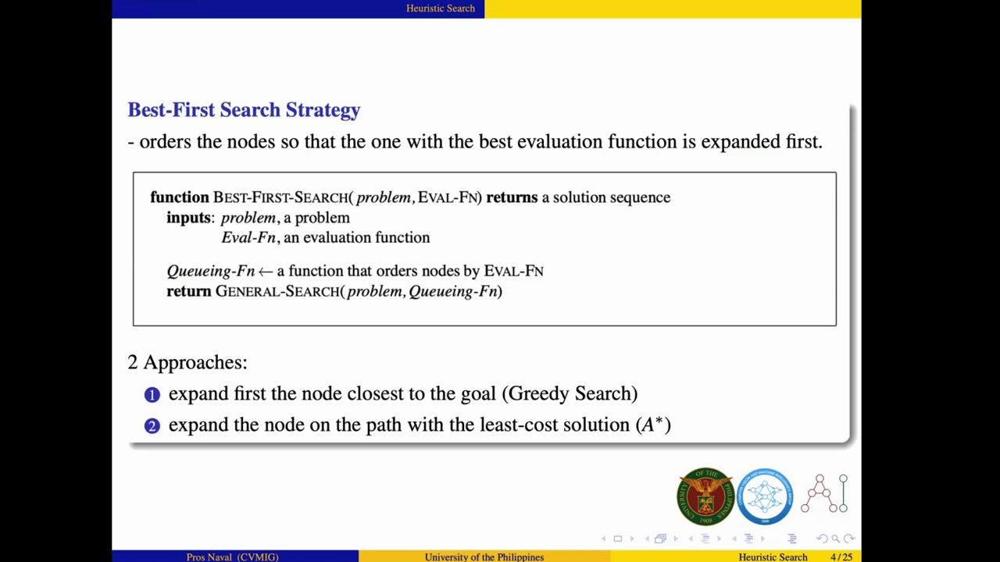

```
function BEST-FIRST-SEARCH(problem, EVAL-FN) returns a solution sequence
    inputs: problem, a problem
            Eval-Fn, an evaluation function
    Queueing-Fn <- a function that orders nodes by EVAL-FN
    return GENERAL-SEARCH(problem, Queueing-Fn)
```

Two approaches, depending on what the evaluation function measures [00:03:32]:

| # | Expand first… | Name |
|---|---|---|
| 1 | the node **closest to the goal** ("it just looks at how close the agent is to the goal") | **Greedy Search** [00:03:32] |
| 2 | the node on the path with the **least-cost solution** | **A\*** [00:04:03] |

---

## B.3 Greedy search and the heuristic function h [00:04:03]

Greedy search "expands the node whose state **appears to be closest to the goal state**" [00:04:03]. The instrument is the heuristic function — and the lecture leans hard on the word *estimate*: "It is an estimate. It is **not an exact value**" [00:04:03].

> **h(n)** = estimated cost of the **cheapest path from the state at node n to a goal state** [00:04:39]
> **h(goal) = 0** — "when the agent has reached a goal, the value of the heuristic function is zero" [00:05:10]

**Greedy search = a best-first search that uses h to select the next node for expansion** [00:05:10].

---

## B.4 The Romania testbed: map + straight-line distances [00:05:44]

Same Arad→Bucharest problem as Part A, but with new information: "In the previous lecture, we did not use the straight line distance… now we would like to incorporate this information … and see how we can actually … search more efficiently because we have more information" [00:05:44]–[00:06:20].

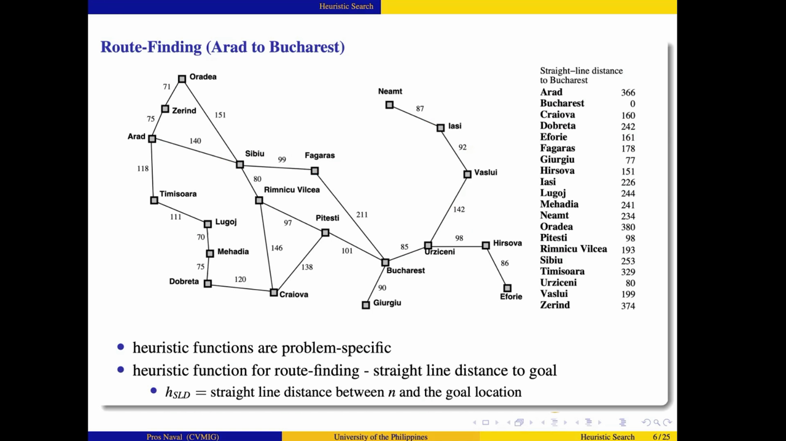

**Straight-line distance (SLD) to Bucharest** (slide 6 — memorize at least Arad 366, Sibiu 253, Fagaras 178, Rimnicu 193, Pitesti 98):

| City | h_SLD | City | h_SLD | City | h_SLD | City | h_SLD |
|---|---|---|---|---|---|---|---|
| Arad | 366 | Fagaras | 178 | Mehadia | 241 | Sibiu | 253 |
| Bucharest | 0 | Giurgiu | 77 | Neamt | 234 | Timisoara | 329 |
| Craiova | 160 | Hirsova | 151 | Oradea | 380 | Urziceni | 80 |
| Dobreta | 242 | Iasi | 226 | Pitesti | 98 | Vaslui | 199 |
| Eforie | 161 | Lugoj | 244 | Rimnicu Vilcea | 193 | Zerind | 374 |

The western corridor of the road map (edge labels = actual road km; redrawn from slide 6):

```
                 99             211
        ┌────── Sibiu ──────── Fagaras ────────┐
    140 │         │ 80                         ▼
Arad ───┤         ▼                        BUCHAREST
        │      Rimnicu ── 97 ── Pitesti ── 101 ─┘
    118 │         │ 146            │ 138
        ▼         └─── Craiova ────┘
    Timisoara     (also: Arad─75─Zerind─71─Oradea─151─Sibiu)
```

Why SLD is a sensible h: "if I connect the line from Arad to Bucharest, that distance is 366 kilometers … if you have GPS information, you can easily do that" [00:08:04]. It is *always shorter than what you actually drive* — "you will be passing through several streets and it's going to be … longer than that straight line distance" [00:08:04] — which is exactly the underestimation property B.7 will name *admissibility*. Note also: "heuristic functions are **problem-specific**" [00:06:54]; h_SLD belongs to route-finding only [00:08:35].

---

## B.5 Worked example: greedy search, Arad → Bucharest [00:09:13]

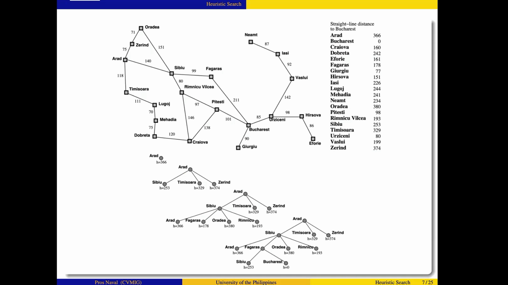

1. **Start at Arad**, h = 366 [00:09:13]. Expand it → Sibiu, Timisoara, Zerind, "each of this will have a straight line distance … according to the table so Sibiu, H is 253" [00:09:47].
2. **Choose the minimum h.** "Of course, you would want to go to a place where you're closer to the destination, right? And that's just logical" [00:10:49].


"You're gonna look at this values, the one with the lowest value is this — Sibiu — so we expand it" [00:10:49]. Note BFS would *also* have expanded Sibiu here, but only by queue position, not by information [00:10:19].

3. **Expand Sibiu** → Arad (366), Fagaras (178), Oradea (380), Rimnicu Vilcea (193). Lowest h = **Fagaras**, so expand it [00:11:23].
4. **Goal appears.**


"When we expand Fagaras, there you are. You have your goal, Bucharest" [00:11:23]. Read the solution by backtracking the pointers: **Arad → Sibiu → Fagaras → Bucharest** [00:11:58]. Final tree (slide 7, stage 4):

```
                    Arad
      ┌──────────────┼─────────────┐
    Sibiu       Timisoara(329)  Zerind(374)
  ┌───────┬─────────┬─────────┐
Arad(366) Fagaras Oradea(380) Rimnicu(193)
        ┌────┴────┐
    Sibiu(253) BUCHAREST(0) ← goal
```

"Quite simple, right?" [00:11:58] — but the very next sentence is the warning: "greedy search **does not always arrive at the optimal solution**" [00:11:58]. Even here the instructor hedges — "It's the right solution *maybe*" [00:12:41] — and B.8 will vindicate the hedge: this route costs 140+99+211 = **450 km** by the map's own edge weights, and A\* finds a cheaper one. What greedy did win is *search effort*: "for this particular example … the best first search algorithm has the **minimum search cost**" [00:12:41] (slide 8). Keep **search cost** (nodes expanded) and **solution cost** (path length) separate in your head — greedy minimized the former and missed the latter.

---

## B.6 Where greedy fails: Iasi → Fagaras [00:12:41]


Slide 8 poses **(Start, Goal) = (Iasi, Fagaras)**. The correct route hugs the roads southwest [00:13:12]:

```
      87        92          142           85            211
Neamt ──── Iasi ──── Vaslui ──── Urziceni ──── Bucharest ──── Fagaras (GOAL)
 dead end   START      ✔ correct first move
```

Expanding Iasi yields **Neamt** and **Vaslui**. Crucial subtlety the instructor spells out: the goal is now Fagaras, so "you shouldn't be using this table" — the printed SLDs are distances *to Bucharest* — "you should be using this distance here, which we don't know" [00:13:12].

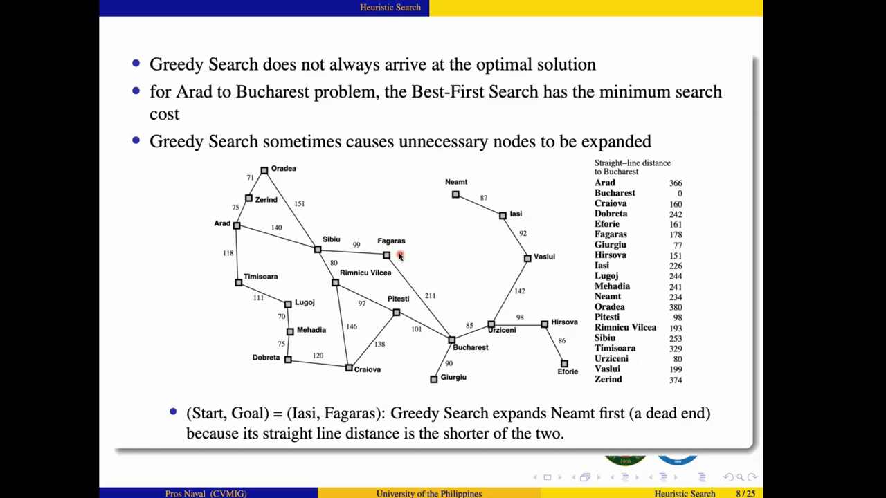

"You know from the diagram that this will have a shorter straight-line distance than this, whatever those values are" [00:13:12] — Neamt sits geometrically closer to Fagaras, so "the algorithm will tell you go to this city, and obviously it's the wrong move. **It's a dead end**, in fact" [00:13:46] (Neamt's only road leads back to Iasi). You can recover — "I'll go the other way. I won't go there anymore next time" — but "you have expanded unnecessarily this node" [00:14:18].

**Greedy search scorecard** (slide 9, [00:14:55]):

| Property | Greedy search |
|---|---|
| Optimal? | **No** |
| Complete? | **No** — "it could start off an infinite path and never return" |
| Time / space (worst case) | **O(b^m)**, m = maximum depth of the search tree |
| In practice | "usually better, depending on the heuristic function" [00:14:55] |

---

## B.7 A\* search: f(n) = g(n) + h(n) [00:15:31]

> "Let's now go to A star. **It's a beautiful algorithm.**" [00:15:31]

Greedy's flaw is tunnel vision: it "basically just considers H" [00:15:31]. The spoken intuition for the fix: "Should I go to this node? Although that node is the cheapest path to the goal, going from the start node to that particular node may actually be a bad idea because the cost of that might be very big. So what the A-star algorithm does is it **takes the sum of the two**" [00:16:10].

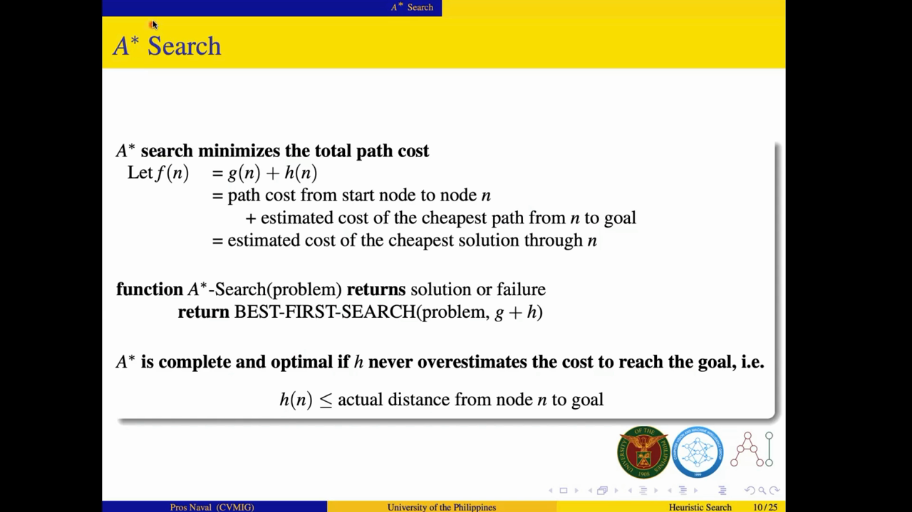

> **f(n) = g(n) + h(n)**
> = path cost from start node to node n **+** estimated cost of the cheapest path from n to goal
> = **estimated cost of the cheapest solution through n** [00:16:41]

A\* is literally one line on top of B.2 — `return BEST-FIRST-SEARCH(problem, g + h)` (slide 10): "we just have this modification, add G plus H, and you have an **optimal** algorithm" [00:17:13].

> **A\* is complete and optimal if h never overestimates the cost to reach the goal**, i.e. **h(n) ≤ actual distance from node n to goal** [00:17:13]. Such an h is called an **admissible heuristic** [00:17:45].

Consequences (slide 11):

- If h is admissible, **f(n) never overestimates the actual cost** of the best solution through n [00:18:20].
- Among algorithms extending paths from the root, **A\* is optimally efficient** for any given heuristic: "no other optimal algorithm is guaranteed to expand fewer nodes than A\*" [00:18:20] (slide 11 credits Dechter and Pearl, 1983).
- The heuristic is the steering wheel: "it's really the heuristic that dictates how much effort A star will make. But then for that given heuristic, **there's no better algorithm than A star**" [00:18:57].

**Exam hook:** "And **we will prove this**. We will prove A star's optimality as well as its completeness" [00:17:45] — the proofs in B.8–B.10 are announced deliverables, not decoration.

---

## B.8 Worked example: A\* on Arad → Bucharest [00:18:57]


1. **Root Arad.** "What is the distance from where I am to my current state? Zero, of course, because I haven't done anything. So **0 + 366**" [00:19:41].
2. **Expand Arad** → for each child, add the road distance actually traveled (g) to the table's h.


"253 is your H. **I got that from here.** … And 140 is the distance from Arad to Sibiu. So that is the effort that I spent … moving from Arad to Sibiu" [00:20:14]. Likewise Timisoara: 118 + 329 = 447 [00:20:14].

3. **Choose the smallest f.**

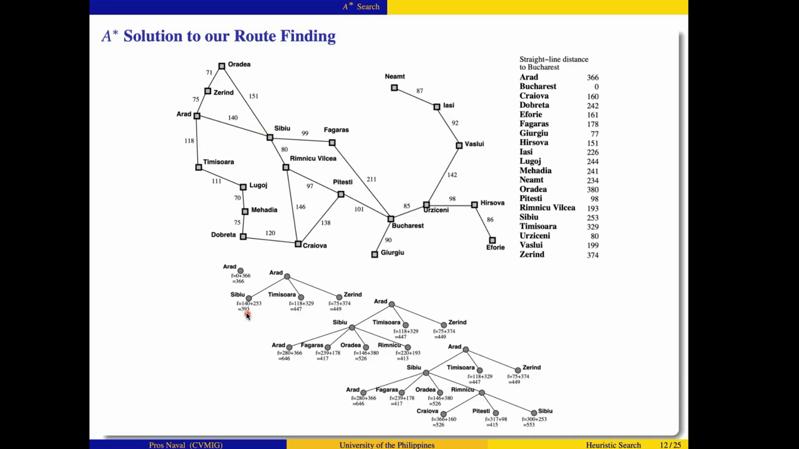

"So now I will have to look at this **sum** and choose the one with the smallest value. And it's still Sibiu as before" [00:20:51] (393 < 447 < 449).

4. **Expand Sibiu, then diverge from greedy.** "Now here, the one with the lowest cost is **Rimnicu**. So expand Rimnicu, go to this, and so on" [00:20:51]. Full tree with every f = g + h (slide 12):

```
                        Arad (0+366=366)
        ┌────────────────┼────────────────────┐
      Sibiu         Timisoara             Zerind
   (140+253=393)    (118+329=447)         (75+374=449)
   ┌──────────┬───────────┬───────────┐
 Arad       Fagaras     Oradea      Rimnicu  ◀ lowest f: expand
(280+366   (239+178    (146+380    (220+193
  =646)      =417)       =526)       =413)
                              ┌──────────┼──────────┐
                           Craiova    Pitesti     Sibiu
                          (366+160   (317+98    (300+253
                            =526)     =415)       =553)
```

**The payoff of adding g:** greedy dove for Fagaras (h = 178); A\* prefers Rimnicu Vilcea because 413 < 417, and after expanding it the frontier's best is **Pitesti (415)**, still ahead of Fagaras (417). The lecture stops at "and so on" [00:20:51], but the slide's edge weights finish the story: Arad–Sibiu–Rimnicu–Pitesti–Bucharest = 140+80+97+101 = **418 km**, beating greedy's Fagaras route of **450 km**. A\* pays a little more search to find the genuinely cheapest path.

---

## B.9 Property 1 — Optimality of A\* (proof by contradiction) [00:21:25]

First recall the cast [00:21:25]–[00:21:56]: g(n) = path cost from start to n; h(n) = estimated cheapest cost n → goal; f(n) = estimate of the path from start to goal *through n*.


Setup: let **G** be an optimal goal state with path cost **f\*** ("we call it F star because it's the *optimal* value" [00:21:56]) and **G₂** a *suboptimal* goal state [00:22:30].

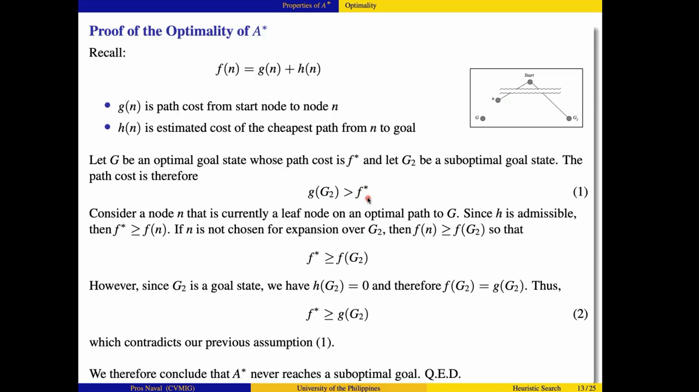

"So this is the optimal path cost, while this one is the suboptimal one" [00:22:30] — and being suboptimal it must cost more:

> **Assumption (1):  g(G₂) > f\*** [00:22:30]

The chain (slide 13, [00:23:09]–[00:24:21]):

| Step | Statement | Why |
|---|---|---|
| a | f\* ≥ f(n) | n is a leaf **on an optimal path to G**, and h is **admissible** [00:23:09] |
| b | f(n) ≥ f(G₂) | suppose n is **not chosen for expansion over G₂** [00:23:39] |
| c | h(G₂) = 0, so f(G₂) = g(G₂) | G₂ **is a goal state** [00:23:39] |
| d | **(2):  f\* ≥ g(G₂)** | chain a→b→c [00:24:21] |

"(2) … contradicts our previous assumption here" [00:24:21] — (1) said g(G₂) > f\*. "This is a **proof by contradiction**. We therefore conclude that **A\* never reaches a suboptimal goal**. Quod erat demonstrandum" [00:24:58]. The picture to keep (slide 13's inset): frontier contours spread out from Start; n sits on a contour on the optimal path down to G; suboptimal G₂ can never be pulled off the queue while n's f is smaller.

---

## B.10 Property 2 — Monotonicity and the pathmax equation [00:24:58]

> **Monotonic heuristic** — one that makes the resulting **f-cost non-decreasing along any path from the root** [00:25:28]. "Most admissible heuristic functions are monotonic" [00:25:28].

If yours isn't, repair it [00:26:05]: take n the **parent** of n′, and suppose **f(n) > f(n′)** — a non-monotonic heuristic. "Observe that any path through n′ is also a path through n," so f(n′) can be disregarded: the true path cost is at least f(n) [00:26:36]. Hence the **pathmax (path max) equation** (slide 14):

> **f(n′) = max( f(n),  g(n′) + h(n′) )**

"We first check the f-cost of the new node to see if it is less than its parent's. If it is so, then **we use the parent's F cost instead**" [00:26:36]–[00:27:13]. Spoken bonus the slide doesn't state: "If we apply this max path equation, **we will expand fewer nodes**" [00:27:13].

---

## B.11 Property 3 — Completeness of A\* [00:27:13]

Since A\* expands nodes in order of increasing f (pathmax repairing any dips), "it will eventually reach a goal state" [00:27:47] — *unless* there are **infinitely many nodes with f(n) < f\*** [00:27:47]. That can only happen when (slide 15):

1. some node has an **infinite branching factor**, or
2. there is a **path with finite path cost but an infinite number of nodes** along it [00:27:47].

> **A\* is complete on locally finite graphs** — graphs with a finite branching factor — provided there is some positive constant δ such that **every operator costs at least δ** [00:28:17].

---

## B.12 Property 4 — Complexity of A\* [00:28:17]

> A\* is of **exponential complexity unless the error in the heuristic grows no faster than the logarithm of the actual path cost** [00:28:17] — slide 16:  **|h(n) − h\*(n)| ≤ O(log h\*)**, where h\*(n) is the *true* cost from n to the goal.

The punchline that motivates the rest of the lecture: "**memory space, more than computation time, is the main drawback of A star**" [00:28:54] — picked up again in B.17.

---

## B.13 Heuristics for the N-puzzle: h₁ vs h₂ [00:28:54]

"What's a good heuristic function for the N-puzzle?" [00:28:54] Two classics, demonstrated on this board (slide 17):


```
Start:  5 4 _        Goal:  1 2 3
        6 1 8               8 _ 4
        7 3 2               7 6 5
```

**h₁ = number of tiles in the wrong position.**

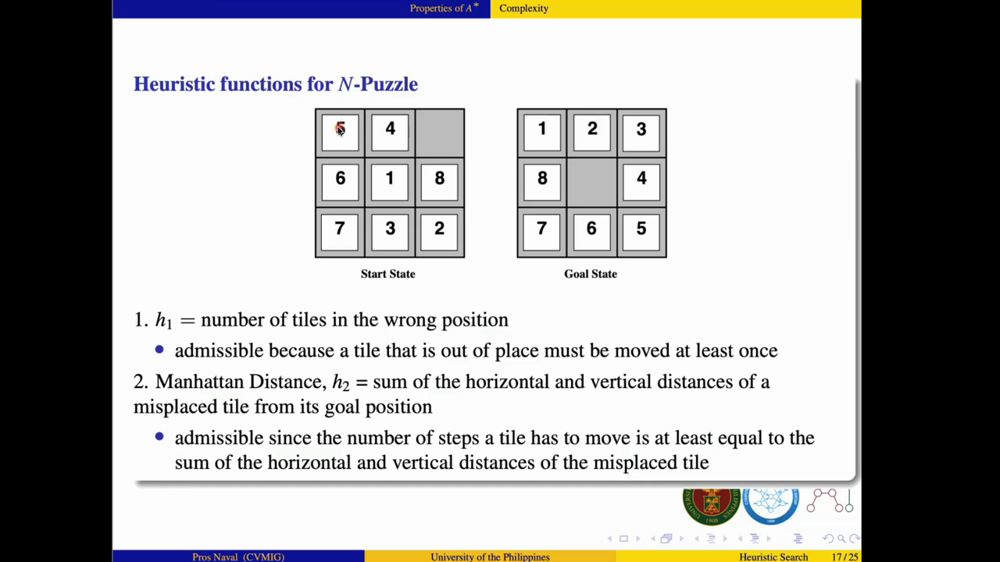

"So this is in the wrong position, right? This is also in the wrong position. It's one, two, then three, four, five, six, seven. All except one are in the wrong position. So **seven**" [00:29:27] — "only this one is in the right position" [00:29:58] (tile 7, bottom-left in both grids). **Why admissible:** "a tile that is out of place must be moved **at least once**" [00:29:58]. E.g. tile 4 must move at least one step to reach its slot, yet h₁ charges it exactly 1 even though "the actual number of moves [is] maybe more" [00:29:58]–[00:30:33].

**h₂ = Manhattan distance** — "the sum of the **horizontal and vertical distances** of a displaced tile from its goal position" [00:30:33].


"Let's take a look at this tile. Five has to move this way. One, two … three, four. So it's 1, 2, 3, 4. This is just for 5. For 4: 1 here — 1, 2" [00:31:07]. So h₂ = "4 plus 2 plus the number of steps that each of these tiles will have to move" [00:31:41]. The lecture computes only those first two terms; finishing the drill from the slide's grids: 5→4, 4→2, 6→2, 1→2, 8→2, 7→0, 3→3, 2→3, total **h₂ = 18**. **Why admissible:** "the number of steps a tile has to move is at least equal to the sum of the horizontal and vertical distances" [00:31:41] (tiles can't move diagonally or jump).

"Obviously the Manhattan distance is a **better estimate**. It's closer to the actual number of steps compared to H1" [00:31:41]–[00:32:12] — and "when we have a better heuristic, we will expand fewer nodes" [00:32:12]. B.14 quantifies that.

---

## B.14 Heuristic accuracy: effective branching factor and dominance [00:32:12]

> Let **N** = total number of nodes expanded by A\* and **d** = solution depth. The **effective branching factor b\*** is the branching factor a uniform tree of depth d would need in order to contain N nodes [00:32:44] — slide 18:
> **N = 1 + b\* + (b\*)² + … + (b\*)^d**

Two facts about b\* [00:33:14]: it is "fairly constant over a wide range of problem instances" for a given heuristic, and "obviously we want … an effective branching factor **close to 1**" (a b\* of 1 means the search walks almost straight to the goal).

> **Dominance:** for the 8-puzzle, for any node n, **h₂(n) ≥ h₁(n)** — "we say that **h₂ dominates h₁**" [00:33:50]. The Manhattan distance is always at least the misplaced-tile count, and closer to the true number of moves [00:34:20].

**Assignment hook (stated outright):** "your assignment, your **programming assignment**, actually will involve **implementing A\***. And once you've implemented that, then you will be able to come up with a table like this" [00:34:20] — reiterated: "you have to see this for yourself, because you have to implement … the 8-puzzle problem using A star" [00:35:33]–[00:36:14].

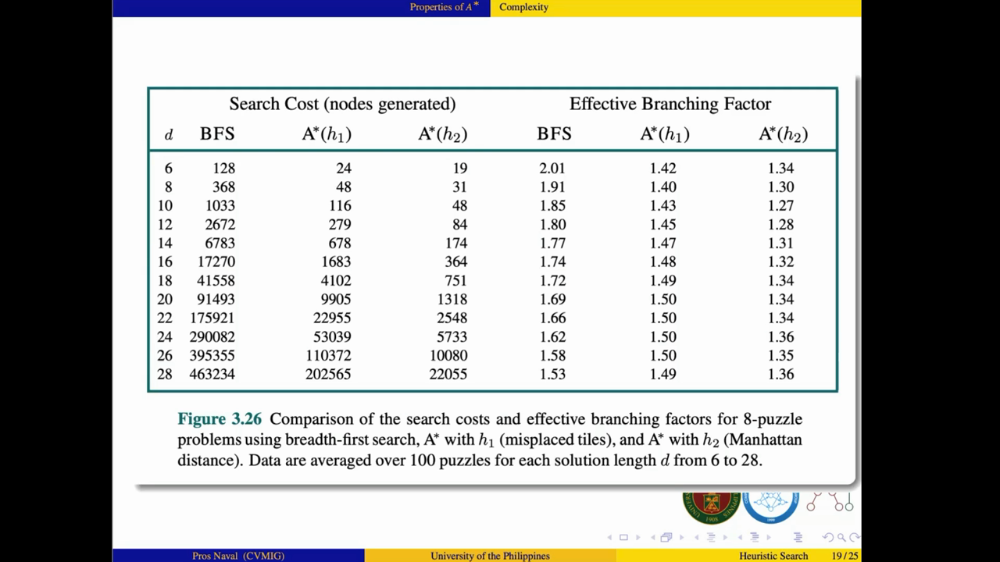

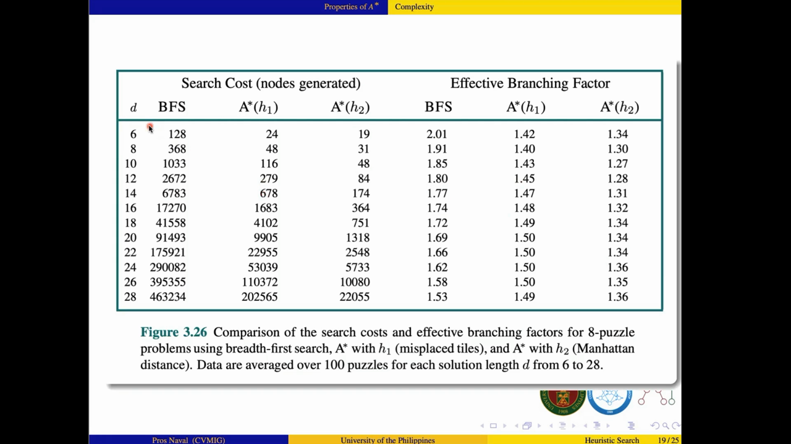

"If the depth of the solution is six, then you'll have 24 nodes expanded or generated. While for A star using the Manhattan distance, you only need 19. As d increases, this becomes **much larger** compared to the other one" [00:34:57]. The full table (slide 19; data averaged over 100 puzzles per depth):

| d | BFS nodes | A\*(h₁) nodes | A\*(h₂) nodes | BFS b\* | A\*(h₁) b\* | A\*(h₂) b\* |
|---:|---:|---:|---:|---:|---:|---:|
| 6 | 128 | 24 | 19 | 2.01 | 1.42 | 1.34 |
| 8 | 368 | 48 | 31 | 1.91 | 1.40 | 1.30 |
| 10 | 1033 | 116 | 48 | 1.85 | 1.43 | 1.27 |
| 12 | 2672 | 279 | 84 | 1.80 | 1.45 | 1.28 |
| 14 | 6783 | 678 | 174 | 1.77 | 1.47 | 1.31 |
| 16 | 17270 | 1683 | 364 | 1.74 | 1.48 | 1.32 |
| 18 | 41558 | 4102 | 751 | 1.72 | 1.49 | 1.34 |
| 20 | 91493 | 9905 | 1318 | 1.69 | 1.50 | 1.34 |
| 22 | 175921 | 22955 | 2548 | 1.66 | 1.50 | 1.34 |
| 24 | 290082 | 53039 | 5733 | 1.62 | 1.50 | 1.36 |
| 26 | 395355 | 110372 | 10080 | 1.58 | 1.50 | 1.35 |
| 28 | 463234 | 202565 | 22055 | 1.53 | 1.49 | 1.36 |

Read down the d = 28 row: blind BFS 463,234 nodes; A\* with the crude h₁ 202,565; A\* with Manhattan **22,055** — a ~9× gap between the heuristics (and a ~21× gap between blind BFS and A\*(h₂)), and h₂'s b\* stays near 1.3 throughout ("effective branching factor is also better on average" [00:35:33]).

> ⚠ Outside the lecture: the slide's caption labels this "Figure 3.26" — it is the standard comparison table from Russell & Norvig's *AIMA* (the same textbook the Romania map comes from), where this material is Chapter 3's informed-search section.

---

## B.15 Combining heuristics [00:36:14]

Given a **collection of admissible heuristics h₁, …, h_m** for a problem, use them all (slide 20):

> **h(n) = max( h₁(n), …, h_m(n) )** [00:36:14]

For the 8-puzzle pair this degenerates — Manhattan "will be bigger in value … so effectively we will be using the Manhattan distance all the time" [00:36:44] — but for problems where different heuristics win on different nodes, "you select the one with the largest value" [00:37:16].

**The cost-of-computing caveat:** "if the heuristic function is so complex that computing its value for a node takes as long as expanding **hundreds of nodes**, a less accurate but simpler heuristic function may make the search cost lower" [00:37:16] — you'd "settle for other admissible heuristics that are simpler to calculate" [00:37:48]. Heuristic quality is accuracy *per unit of computation*, not accuracy alone.

---

## B.16 A\* pseudo-code: OPEN and CLOSED [00:37:48]

The implementable version "does not build a tree-like structure … rather it uses a list which we'll call **OPEN**, containing nodes ready for expansion, and another list called **CLOSED**, containing expanded nodes" [00:38:20]. This is the version the programming assignment expects.

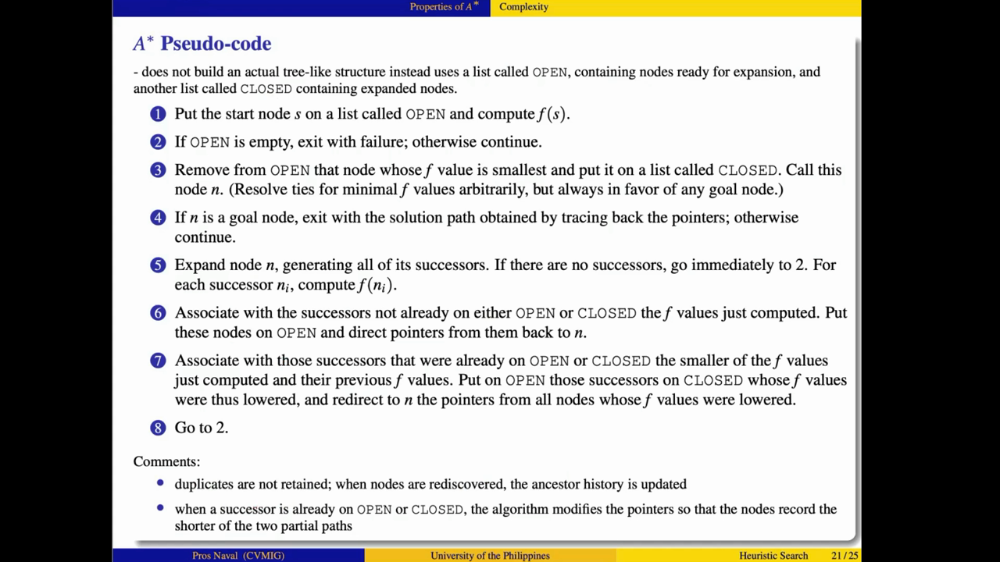

1. Put the start node *s* on **OPEN** and compute f(s) [00:38:20].
2. If OPEN is empty, exit with **failure**; otherwise continue [00:38:20].
3. Remove from OPEN the node whose **f value is smallest**, put it on **CLOSED**, call it *n*. Resolve ties arbitrarily — "randomly select any of this — but **always in favor of any goal node**" [00:38:54].
4. If *n* is a goal node, exit with the solution path **obtained by tracing back the pointers**; otherwise continue [00:39:26].
5. Expand *n*, generating all successors. If none, go to 2. For each successor nᵢ compute f(nᵢ) [00:39:26].
6. Successors on **neither** list: assign the just-computed f values, put them on OPEN, direct pointers **back to n** [00:39:26]–[00:39:57].
7. Successors **already** on OPEN or CLOSED: keep the **smaller** of the new and previous f values; move back onto OPEN any CLOSED successors whose f was thus lowered; **redirect to n** the pointers of all nodes whose f was lowered [00:39:57].
8. Go to 2 — "iterating until we exit" [00:40:34].

Why steps 6–7 matter — "the **beauty** of this code" [00:40:34]:

- **duplicates are not retained** — when nodes are rediscovered, the ancestor history is updated;
- when a successor is already on OPEN or CLOSED, the pointer surgery makes nodes "record the **shorter of the two partial paths**" [00:40:34].

---

## B.17 Memory-bounded search: IDA\* [00:41:09]

"For most search algorithms, **the first thing to give is usually the available memory**" [00:41:09]. Concretely: A\* "requires exponential space in many cases" and **cannot solve the 15-puzzle on most machines** because of excessive space [00:41:09] (slide 22) — the B.12 drawback biting.

The fix (slide 23): **Iterative Deepening A\*** — attributed on the slide to **Korf**, "similar, probably inspired by, the iterative deepening search algorithm in the previous lecture" [00:41:41].

> **IDA\*** = a modification of A\* that reduces **space complexity from exponential to linear** [00:41:41]. It performs a **series of depth-first searches** in which a branch is **cut off when the cost of its frontier node, f(n) = g(n) + h(n), exceeds a cutoff threshold** [00:42:15].

Where plain DFS-style iterative deepening cut on *depth*, "here we use the frontier node cost" [00:42:15]. The threshold schedule [00:42:49]:

- **starts** at the heuristic estimate of the initial state, and
- each iteration is **increased to the minimum value that exceeded the previous threshold**, until a solution is found.

**Cost accounting** (slide 23, [00:42:49]–[00:43:26]):

| | A\* | IDA\* |
|---|---|---|
| Time | exponential | exponential — "IDA\* cannot outperform A\* … when it comes to this" [00:42:49] |
| Space | exponential (in most cases) | **linear** — "proportional to the longest path it explores, since it is depth-first" [00:42:49]; storage ≈ **b·d nodes** [00:43:26] |
| Can solve | 8-puzzle, **not** the 15-puzzle [00:41:09] | **the 15-puzzle — but not the 24-puzzle** [00:43:26] |

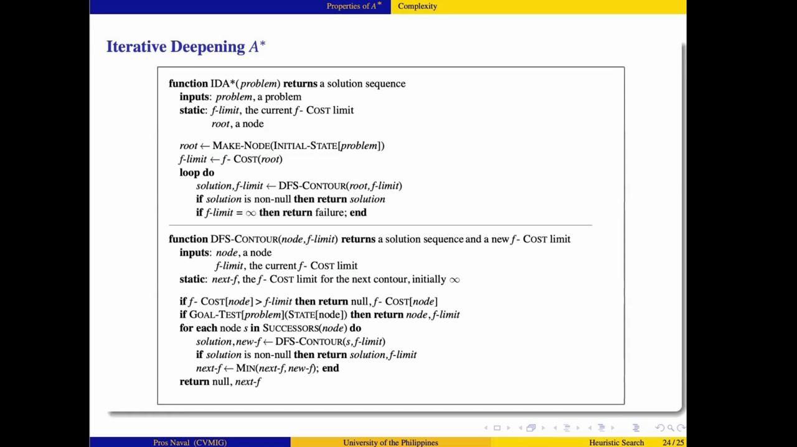

"This is how it looks like" [00:43:26] — slide 24's two functions, a driver loop plus the recursive DFS-CONTOUR, worth reading against B.16:

```
function IDA*(problem) returns a solution sequence
   root    <- MAKE-NODE(INITIAL-STATE[problem])
   f-limit <- f-COST(root)
   loop do
      solution, f-limit <- DFS-CONTOUR(root, f-limit)
      if solution is non-null then return solution
      if f-limit = INFINITY  then return failure

function DFS-CONTOUR(node, f-limit) returns solution + new f-COST limit
   static: next-f, initially INFINITY
   if f-COST[node] > f-limit then return null, f-COST[node]   ← the cutoff
   if GOAL-TEST[problem](STATE[node]) then return node, f-limit
   for each node s in SUCCESSORS(node) do
      solution, new-f <- DFS-CONTOUR(s, f-limit)
      if solution is non-null then return solution, f-limit
      next-f <- MIN(next-f, new-f)                ← next threshold = min overshoot
   return null, next-f
```

And that closes the lecture [00:43:26].

---

### Part B exam checklist

Cover the right columns.

| Concept / skill | The one-line answer | Where |
|---|---|---|
| Only place knowledge enters GENERAL-SEARCH | the **queuing function** | [00:01:44] |
| Evaluation function | measures **desirability of expanding a node**; best-first expands best-valued node first | [00:02:19] |
| h(n), and h(goal) | estimated cost of cheapest path from n to goal; **h(goal) = 0** | [00:04:39], [00:05:10] |
| Greedy vs A\* in one line | greedy uses **h only**; A\* uses **f = g + h** | [00:03:32], [00:16:41] |
| Run greedy on Arad→Bucharest | Sibiu (253) → Fagaras (178) → Bucharest; path Arad–Sibiu–Fagaras–Bucharest | [00:09:47]–[00:11:58] |
| Why greedy fails on Iasi→Fagaras | Neamt's SLD to Fagaras < Vaslui's, but Neamt is a **dead end** (and the printed table is to Bucharest — wrong goal) | [00:13:12]–[00:14:18] |
| Greedy properties | not optimal, not complete, worst case **O(b^m)** | [00:14:55] |
| Admissible heuristic | **h(n) ≤ actual distance** n→goal; makes A\* complete and optimal | [00:17:13]–[00:18:20] |
| Optimally efficient | no other optimal algorithm guaranteed to expand fewer nodes (Dechter & Pearl 1983, slide 11) | [00:18:20] |
| Run A\* on Arad→Bucharest | Sibiu (393) → Rimnicu (413) → Pitesti (415) next — diverges from greedy at step 3 | [00:19:41]–[00:20:51] |
| Reproduce the optimality proof | assume g(G₂) > f\*; derive f\* ≥ f(n) ≥ f(G₂) = g(G₂); contradiction ⇒ A\* never reaches a suboptimal goal | [00:22:30]–[00:24:58] |
| Monotonicity + pathmax | f non-decreasing along any path; repair with **f(n′) = max(f(n), g(n′)+h(n′))** — expands fewer nodes | [00:25:28]–[00:27:13] |
| Completeness conditions | complete on **locally finite graphs** with every operator cost ≥ δ > 0 | [00:27:47]–[00:28:17] |
| Complexity condition | exponential unless **\|h(n) − h\*(n)\| ≤ O(log h\*)**; main drawback = **memory** | [00:28:17]–[00:28:54] |
| h₁ and h₂ on the slide's board | h₁ = misplaced tiles = **7** (only tile 7 placed); h₂ = Manhattan (tile 5 → 4, tile 4 → 2, …); both admissible, know *why* | [00:29:27]–[00:31:41] |
| Effective branching factor | b\* from **N = 1 + b\* + … + (b\*)^d**; want b\* ≈ 1; fairly constant per heuristic | [00:32:44]–[00:33:14] |
| Dominance | h₂(n) ≥ h₁(n) ∀n ⇒ **h₂ dominates h₁** ⇒ fewer nodes (d=6: 24 vs 19; d=28: 202,565 vs 22,055) | [00:33:50], [00:34:57] |
| **Programming assignment** | implement **A\* on the 8-puzzle** and reproduce the Figure 3.26-style table yourself | [00:34:20], [00:35:33] |
| Multiple heuristics | **h(n) = max(h₁…h_m)**; but prefer a simpler admissible h if the accurate one costs as much as expanding hundreds of nodes | [00:36:14]–[00:37:16] |
| A\* pseudo-code details | OPEN/CLOSED lists; ties **favor goal nodes**; rediscovered nodes keep the **smaller f** and repointed parent; no duplicates | [00:38:54]–[00:40:34] |
| IDA\* | series of DFS with **f-cost cutoff**; threshold starts at h(start), rises to min overshoot; linear space ≈ **b·d**; solves 15-puzzle, not 24-puzzle | [00:42:15]–[00:43:26] |

---

# Part C — Adversarial Search (Lecture 3C)

Parts A and B searched worlds that sat still: blind search when we know nothing (3A), heuristic search when we can estimate distance to the goal (3B). Lecture 3C adds the missing ingredient of real competition — an **opponent** who acts to make your outcome worse. The lecture (59:20, Pros Naval, 34 slides) climbs the classical ladder: game playing in AI, minimax, alpha-beta pruning, heuristic alpha-beta search with the chess bag of tricks, Monte Carlo Tree Search for Go, and chance nodes for stochastic games. The through-line: the same search machinery as Parts A/B, progressively adapted to survive an adversary, a clock, and dice.

Source: `_generated/transcripts/Lecture_3C_Adversarial_Search.md`. All timestamps cite the transcript.

---

## C.1 Game playing in AI [00:01:09]

Why board games? They offer **pure, abstract competition** [00:01:09] (less abstract games like robot soccer also interest AI). Worth memorizing:

> **Game playing is an idealization of worlds in which there are hostile agents that act so as to diminish one's well-being.** [00:01:42]

Games are useful because they help us understand **how to act in complex and uncertain domains** [00:01:42].

### Two types of games, and a vocabulary bridge [00:02:15]

1. **Games of perfect information** — the knowledge available to each player is the same: *"What player A sees is also what player B sees"* — chess, Go [00:02:15]
2. **Games of imperfect information** — you can't see the opponent's hand — poker

The slide's glossary maps game vocabulary onto Parts A/B's search vocabulary [00:02:59]:

| Game term | Search term |
|---|---|
| perfect information | **fully observable** environment |
| move | **action** |
| position | **state** |

In two-person games (chess) players **alternate moves**; in multi-agent games agents can **form teams** and collaborate to beat their adversaries [00:03:32].

### Where uncertainty comes from [00:04:04]

The opponent introduces uncertainty: the agent doesn't know what the opponent will do. In general, uncertainty arises from three sources [00:04:04]:

1. **Incomplete knowledge of the environment** — a robot navigating with an incomplete map
2. **An opponent** who acts to divert the agent from its goal [00:04:39]
3. **Computational constraints** — not enough time to calculate the exact consequences of each move [00:04:39]

### Time limits, anytime algorithms, contingency [00:04:39]

Games have **time limits**, so execution efficiency matters — this reality *"has spurred the development of anytime algorithms"* [00:05:13]: interruptible anytime, and given more processing time they return a **higher-quality solution** (Lecture 1's definition, restated here).

**All games are contingency problems** [00:05:49]: the agent must calculate a whole tree of actions where each branch deals with what the opponent will do. How to cope with the clock? *"Use techniques that allow us to ignore portions of the search tree that will make no difference to the final choice"* [00:05:49] (alpha-beta, coming in C.3) — plus **heuristic evaluation functions** that *"measure how good a position is without doing a complete search"*. Same purpose as Part B's `h(n)`: **reduce the search space explored** [00:06:25].

### The base-level/meta-level trade-off [00:06:25]

A heuristic can be so complicated that computing it eats the time you'd otherwise spend expanding nodes [00:07:04]. The slide's paired definitions:

> **Base-level activity** — effort spent trying to solve the problem.
> **Meta-level activity** — effort spent in deciding what to do. [00:07:35]

> **Trade-off:** time spent at the meta-level **must be recovered** by corresponding reductions in the time required to solve the problem at the base-level. [00:08:07]

**Exam hook:** the instructor closes with *"You will see this later"* [00:08:07] — and it comes back when chess evaluation functions trade accuracy against time cost in §C.4 [00:35:43].

### The formal model of a two-person game [00:08:37]

A game is a problem with an initial state, operators, goal test, and path cost [00:08:37] — concretely, five components (slide 7 recreated):

| Component | Meaning |
|---|---|
| **S₀** — initial state | board configuration + *whose turn it is* (chess: always White, by rule [00:09:10]) |
| **To-Move(s)** | the player whose turn it is to move in state *s* [00:09:10] |
| **Actions(s)** | the set of legal moves in state *s* [00:09:46] |
| **IsTerminal(s)** | is the game over? Terminal states play the role of goals [00:10:19] |
| **Utility(s, p)** | utility / objective / **pay-off** function: numeric value of the final outcome to player *p* [00:10:19] |

---

## C.2 Minimax [00:10:49]

Minimax is *"the most basic game playing algorithm in AI"* [00:00:35] — the algorithm that decides **which move to take** [00:10:49].

### Setup: MAX vs MIN [00:11:20]

Two players, **Max** and **Min** — *we want Max to win*. Max tries to **maximize** the pay-off function, Min to **minimize** it; it is always **Max's turn at the start** [00:11:20].

> Max will try to find a strategy that leads to a winning state **regardless of what Min does**. [00:11:56]

First consider the ideal case with **no time limit**: we can compute the **entire search tree** down to the terminal states [00:11:56].

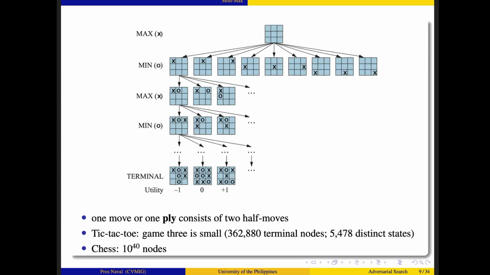

The tic-tac-toe tree [00:12:33]: root is the empty board (Max plays x), fanning out to the nine first moves, down to terminal boards scored by Utility. Definitions and numbers to keep:

- **One move = one ply = two half-moves, one by each player** [00:12:33]
- Tic-tac-toe's tree is small: **362,880 terminal nodes**, **5,478 distinct states** (slide's exact figures) — versus chess at about **10⁴⁰ nodes** [00:13:14]

> ⚠ Outside the lecture: AIMA uses "ply" for a *single* half-move; the slide equates one ply with a full move. On the exam, follow the lecture.

Utility values for tic-tac-toe: **0 = tie, +1 = Max won, −1 = Max lost** [00:13:45].

### The optimal strategy [00:13:45]

Max's turn: pick the action **maximizing** the minimax result; Min's turn: the action **minimizing** it; terminal state: return the utility [00:13:45]:

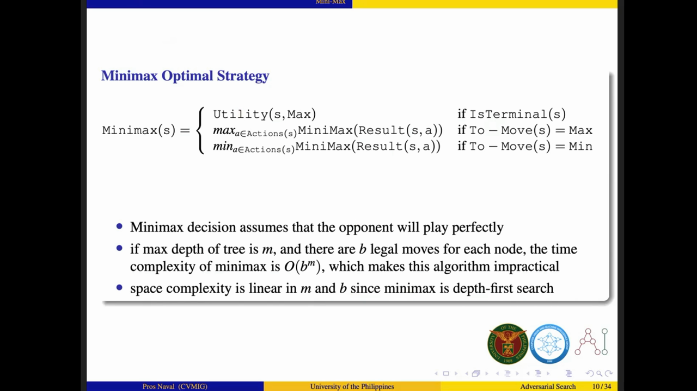

```
Minimax(s) =
  Utility(s, Max)                               if IsTerminal(s)
  max_{a ∈ Actions(s)} Minimax(Result(s, a))    if To-Move(s) = Max
  min_{a ∈ Actions(s)} Minimax(Result(s, a))    if To-Move(s) = Min
```

Two properties to flag: **minimax assumes the opponent plays perfectly** [00:14:25]; and with maximum depth *m* and *b* legal moves per node, time complexity is **O(bᵐ)** — *"impractical because it is exponential in the depth of the tree"* — while space is **linear in m and b** because minimax is depth-first [00:14:57].

### How minimax actually runs [00:15:40]

1. Generate the entire game tree to the terminal states
2. Compute each terminal state's pay-off with the utility function [00:15:40]
3. Back the values up one level: a node's value is the **lowest** pay-off of its children on Min's turn, the **highest** on Max's turn [00:16:12]
4. Continue backing up from the leaves toward the root, one level at a time
5. At the root, Max chooses the branch leading to the **highest pay-off** [00:16:43]


The worked example [00:16:43]:

```
MAX                A = 3
            a1 ▶ /   |   \
                /    |    \
MIN          B=3    C=2    D=2
            / | \  / | \  / | \
leaves     3 12 8  2 4 6  14 5 2
```

Min expands B and sees 3, 12, 8 — *"since min chooses the minimum, it will have this value 3 here"* [00:17:17]; likewise C = min(2, 4, 6) = 2 and D = min(14, 5, 2) = 2 [00:17:50].

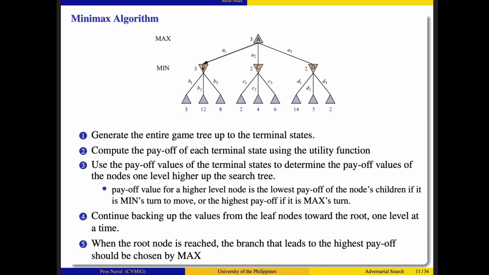

Then A maximizes over what it's offered: max(3, 2, 2) = 3, *"therefore, the correct action for max is action a₁"* [00:17:50].

### Multiplayer games: back up vectors, not numbers [00:18:23]

With more than two players, each node returns a **vector of values** — one utility per player, e.g. ⟨v_A, v_B, v_C⟩ [00:18:23].

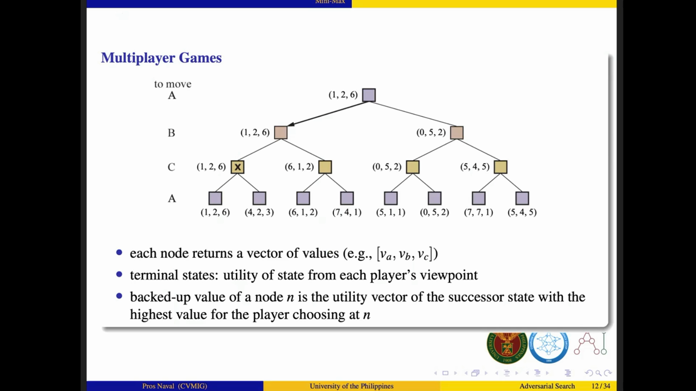

Each player maximizes **its own component**. At the deepest choice, C compares its own entries — *"the value for C is 6… 6 versus 3. So since C is trying to maximize its values it will choose this move"* [00:18:23]: (1, 2, 6) over (4, 2, 3); at its other node it takes a 2 rather than a 1 [00:19:02]. One level up, *"B will be looking at the second value. So therefore the correct action is this for B"* [00:19:36]:


A then maximizes the **first** element, choosing the branch backing up (1, 2, 6) [00:19:36].

> The backed-up value of a node *n* is the **utility vector of the successor with the highest value for the player choosing at n**. [00:20:10]

### Chess as a formal game [00:20:47]

Chess: perfect information, 8 × 8 board. Initial state: white corner square to the player's right; white queen on white, black queen on black; rooks on the corners, then knights, then bishops; pawns on the second row [00:20:47]. The actions (slide 13 recreated):

| Piece | Legal moves |
|---|---|
| Pawn | forward only; first advance 1 or 2 squares, thereafter 1; captures diagonally, forwards only [00:21:25] |
| Rook / Bishop / Queen | row+column-wise / diagonally / both — any distance unless blocked [00:21:25] |
| Knight | L-movements [00:22:06] |
| King | one step at a time [00:22:06] |

All pieces **except the pawn** capture in their normal direction of movement; capturing is **not obligatory**; the objective is to **capture the opponent's king** [00:22:06].

### Imperfect decisions: what changes under a clock [00:22:41]

For practically all real games there **is** a time limit, and memory is limited too [00:22:41]. Humans don't analyze to the end — we **look a few moves ahead**, evaluate the non-terminal position, and back up that value. *"Minimax still applies. It's the same principle"* [00:23:16]. So modify minimax in two ways [00:23:47]:

1. Replace the utility function with an **evaluation function** — *"a function that returns an estimate of the pay-off value"*
2. Replace the terminal test with a **cut-off test** — e.g., think only four moves forward and ignore everything beyond [00:24:24]

Minimax computes the optimal strategy but does so **inefficiently** — full tree, then back up static evaluations. *"Can we do better?"* [00:24:24]

---

## C.3 Alpha-beta pruning [00:24:56]

> Alpha-beta pruning is a modification of minimax that allows the **non-consideration of portions of the tree that are not worth looking into**. [00:24:56]

### The idea, on one tree [00:25:28]


Take the familiar two-ply tree, but leave two leaves under C unevaluated (x, y). The root *"maximiz[es] the minimum values"* of each group [00:25:28]:

```
Minimax(root) = max( min(3,12,8), min(2,x,y), min(14,5,2) )
              = max( 3,           z,          2 )      where z = min(2,x,y) ≤ 2
              = 3                 ✂ x and y never need to be evaluated
```

Whatever x and y are, z can never beat 3 — *"the backup value at the root remains 3"* [00:26:01]. The search can skip them entirely:

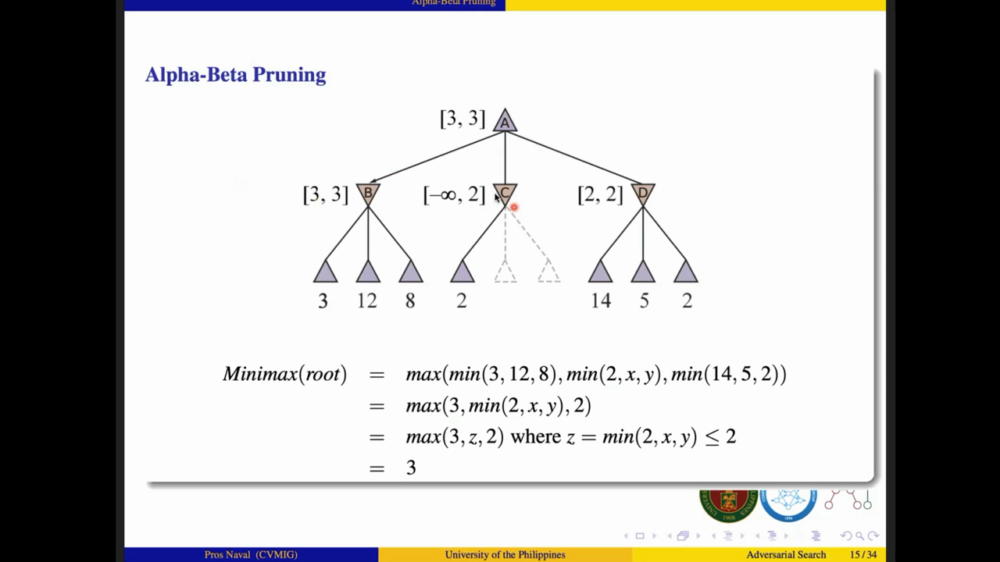

*"We can prune the tree because this part of the tree is now irrelevant to the decision"* of your agent [00:26:01].

### The chess intuition [00:26:38]


Suppose your quiet continuation already evaluates to **0.03**. The other option attacks his queen, a queen trade follows, and the evaluations underneath are **−0.05** and **−0.1** [00:26:38]:

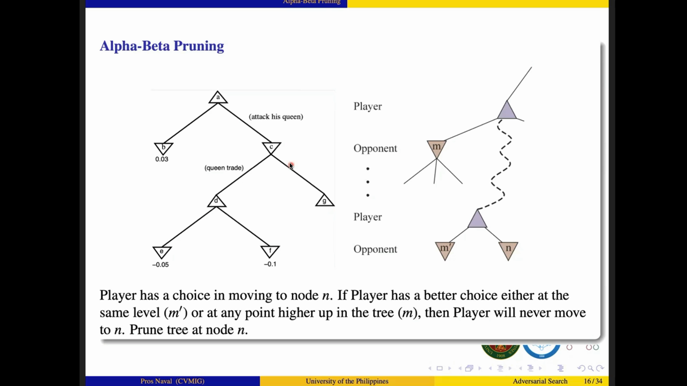

*"Since we already have 0.03 here… and we see this negative… there's no more point in examining the other node"* [00:27:09][00:27:42]. Generalizing (slide 16's right figure, nodes m, m′, n):

> If a player has a choice of moving to node *n*, and the player has a **better choice** either at the same level (m′) or at any point higher up the tree (m), then the player will **never move to n** — so prune the tree at node *n*. [00:28:13]

### α and β, precisely [00:28:53]

> **α** = the value of the best (**highest**-value) choice found so far at any choice point along the path to **Max** (α = "at least").
> **β** = the value of the best (**lowest**-value) choice found so far at any choice point along the path to **Min** (β = "at most"). [00:28:53]

Alpha-beta search **prunes the remaining branches at a node as soon as the current node's value is known to be worse than the current α or β** (for Max or Min respectively) [00:29:25].

### Move ordering decides how much you save [00:29:25]

Alpha-beta is **highly dependent on the order in which states are examined** — so examine first the successors **likely to be best** [00:29:59]. Effect on complexity (slide 17):

| Ordering | Time complexity |
|---|---|
| none (plain minimax) | O(bᵐ) |
| perfect ordering | **O(b^(m/2))** [00:29:59] |
| random ordering | O(b^(3m/4)) [00:30:34] |

For chess, the average effective branching factor is about **35**; with alpha-beta under perfect ordering it drops to **√35 ≈ 6** [00:30:34][00:31:11].

> **Exam hook:** *"Reduction from 35 to 6. And that is a big, big reduction"* [00:31:11]. Know the ordering recipe that earns it — examine **captures**, then **threats**, then **forward moves**, then **backward moves** [00:31:11].

### The algorithm [00:31:43]


```
function MAX-VALUE(game, state, α, β) returns a (utility, move) pair
    if game.IS-TERMINAL(state) then return game.UTILITY(state, player), null
    v ← −∞
    for each a in game.ACTIONS(state) do
        v2, a2 ← MIN-VALUE(game, game.RESULT(state, a), α, β)
        if v2 > v then
            v, move ← v2, a
            α ← MAX(α, v)
        if v ≥ β then return v, move          ← cutoff
    return v, move

function MIN-VALUE(game, state, α, β) returns a (utility, move) pair
    if game.IS-TERMINAL(state) then return game.UTILITY(state, player), null
    v ← +∞
    for each a in game.ACTIONS(state) do
        v2, a2 ← MAX-VALUE(game, game.RESULT(state, a), α, β)
        if v2 < v then
            v, move ← v2, a
            β ← MIN(β, v)
        if v ≤ α then return v, move          ← cutoff
    return v, move
```

*"Similar to minimax, except that bounds are maintained in the variables alpha and beta, which are used to cut off the search when a value is outside the bounds"* [00:31:43]. Pointing at the cutoff lines: *"this part here… basically gives us a window of alpha and beta. If the value is outside that alpha-beta window, then we can actually prune the tree"* [00:32:17]:

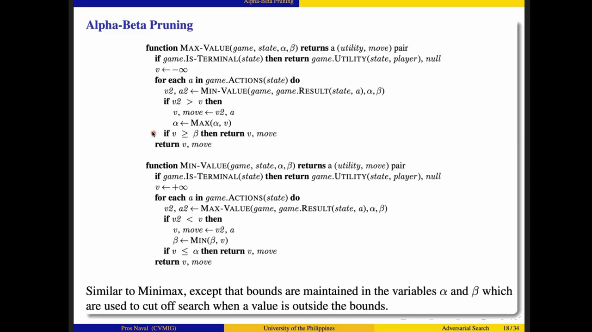

---

## C.4 Heuristic alpha-beta tree search [00:32:47]

We improve alpha-beta by plugging in the **heuristic evaluation function** [00:32:47].

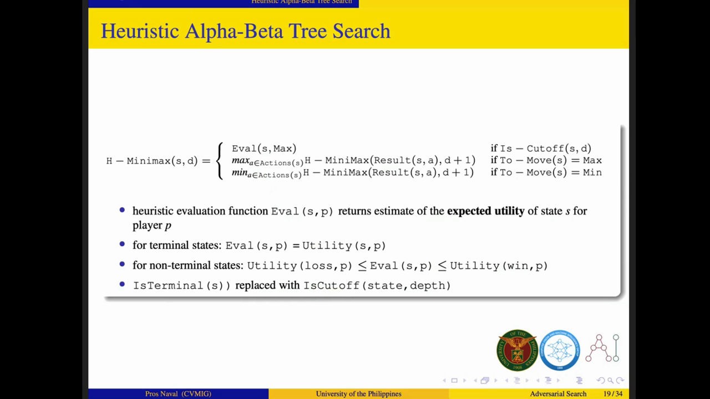

```
H-Minimax(s, d) =
  Eval(s, Max)                                         if Is-Cutoff(s, d)
  max_{a ∈ Actions(s)} H-Minimax(Result(s, a), d + 1)  if To-Move(s) = Max
  min_{a ∈ Actions(s)} H-Minimax(Result(s, a), d + 1)  if To-Move(s) = Min
```

`Eval(s, p)` is an **estimate of the expected utility** of state *s* for player *p* [00:32:47]. At terminal states `Eval(s, p) = Utility(s, p)`; at non-terminal states it lies between the losing and winning utilities: `Utility(loss, p) ≤ Eval(s, p) ≤ Utility(win, p)` [00:33:22]. And `IsTerminal(s)` is replaced by `IsCutoff(state, depth)` [00:33:58].

### Evaluation functions for chess [00:33:58]

Scale first: branching factor ≈ 35, a typical game runs about **50 moves**, so there are about **35¹⁰⁰ nodes** to consider [00:33:58]. The evaluation function combines **material value + good positional features** [00:34:38]:

| Term | Value |
|---|---|
| pawn | **1** — *"For the pawn, for example, we assign a value of 1"* [00:34:38] |
| knight / bishop | **3** |
| rook | **5** |
| queen | **9** |
| good pawn structure (a pawn defends another pawn) | **+0.5** [00:35:08] |
| isolated pawn (no pawns on adjacent files) | **−1/3** [00:35:08] |
| control of the center; how well protected the king is | further terms |

All these values are **added together** to form the evaluation function [00:35:08].

### Quality vs cost — the meta-level trade-off returns [00:35:43]

Performance depends greatly on the **quality** of the evaluation function — quality = *how close it is to the pay-off value* [00:35:43]. And there's a trade-off between **accuracy and time cost** (§C.1's base/meta trade-off): if the function is very complicated, *"probably it's better to come up with a simpler evaluation function and spend the time evaluating nodes"* [00:36:17].

- **Material value is fast**: each piece can be judged independently → a **weighted linear function** [00:36:17]
- **Positional features are slow**: an isolated pawn requires looking at the *other* pawns' positions → a **nonlinear** function [00:36:50]

The linear form [00:36:50]:

```
Eval(s) = w₁f₁(s) + w₂f₂(s) + … + wₙfₙ(s) = Σᵢ wᵢ fᵢ(s)
```

where the fᵢ are features and the wᵢ weights — with the **strong assumption that features are independent of each other** [00:37:22]. For nonlinear evaluation, use a sophisticated function approximator **such as a neural network** [00:37:22].

### When to cut off search [00:37:22]

1. a **fixed depth limit**, or
2. **iterative deepening search** — an **anytime algorithm**: when time is up, return the best solution at hand [00:37:53]

### The horizon effect [00:38:24]

The evaluation function only gives **estimates** — with consequences. The **horizon effect** arises *"when there is a threat that appears unavoidable"*: instead of dealing with it, the program plays useless moves — *"a nuisance check"* — that **push the threat over the horizon** [00:38:24]. If the program only looks, say, **14 moves** ahead (as in Deep Blue), after 14 moves the threat is out of sight [00:39:18]. The core difficulty:

> It is difficult to distinguish between a move that **really neutralizes** the threat and one that **just pushes it over the horizon**. [00:39:49]

Proposed solutions (slide 23):

| # | Technique | What it does |
|---|---|---|
| 1 | **Secondary search** | examine the space **beneath the apparently best move** to see if something was pushed beyond the horizon; if so, choose an alternative move [00:39:49] |
| 2 | **Killer heuristic** | if a move is good for your opponent, **look at it early** when considering the opponent's actions [00:40:34] |
| 3 | combine 1 + 2 | still, *not all* instances of the horizon problem can be avoided [00:40:34] |

### "Hot" subtrees: quiescence and singular extensions [00:40:34]

Another consequence of inexact evaluations: **some portions of the game tree are hotter than others** [00:40:34]. A move leading to **lengthy piece exchanges** should be investigated to greater depth: there the evaluation values change rapidly, and *"when there is such rapid change… the values of the function become unreliable"* [00:41:13]. We can only trust `Eval` when its value changes **slowly from ply to ply** [00:41:45].

- **Quiescence search** — expand non-quiescent positions further **until quiescent positions are reached** (where the evaluation isn't changing too fast) [00:41:45]
- **Singular extension search** [Anantharaman et al., 1990] — examine a node to greater depth **if one of the opponent's moves is vastly preferable to him than all other options**; that move is *forced* in some sense, so the effective branching factor is small [00:42:20] — *"believed to be the reason why Deep Thought outperformed its predecessor, HiTech"* [00:42:52]

### Forward pruning: ProbCut [00:42:52]

Alpha-beta prunes any node **provably** outside the current α–β window [00:42:52]. **Probabilistic Cut (ProbCut)** is a forward-pruning variant that prunes nodes **probably** outside the window [00:43:27] — *"here we're sure… so we prune the node. But here it's highly probable"* [00:43:59]. The probability comes from a **shallow search** for a backed-up value plus **past experience** estimating how likely the score is outside the window [00:43:59].

### Lookup tables for openings and endgames [00:44:29]

On move one or two, why search 14 moves deep? **Rely on human experts**: store known openings — Sicilian, French, Ruy Lopez — in a database and just use them [00:44:29][00:45:03]. For endgames, use rules for known configurations — **king-and-rook vs king (KRK)**, **king-bishop-knight vs king (KBNK)** — instead of regenerating a search tree [00:45:03]. The catch: such tables can hold around **400 trillion entries** for KBNK endings [00:45:40].

---

## C.5 Monte Carlo Tree Search (MCTS) [00:46:13]

### Go, the game that broke alpha-beta [00:46:13]

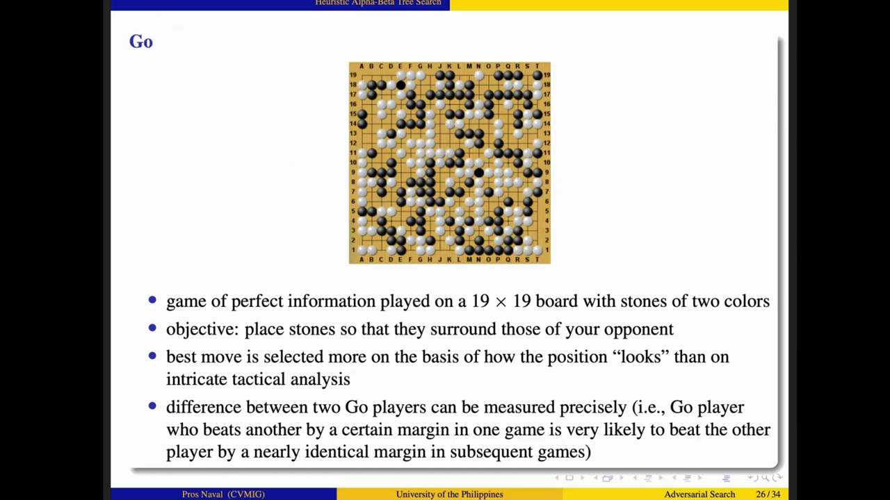

Go: perfect information, played on a **19 × 19** board with stones of two colors; the objective is to play stones so they **surround your opponent's** [00:46:13]. Two peculiarities [00:46:43]: the best move is selected more on **how the position looks** than on intricate tactical analysis; and the difference between two Go players **can be measured precisely** — a player who wins by a certain margin will very likely win by a nearly identical margin in subsequent games [00:46:43].

**Go has motivated the development of the Monte Carlo Tree Search algorithm** [00:47:15], because alpha-beta collapses here:

- branching factor **> 360** → alpha-beta can only search **4 to 5 ply** [00:47:15]
- it's hard to define a good evaluation function for Go: **material value is not a good indicator**, and **most positions are in flux until the endgame** [00:47:49]

### The MCTS idea: simulate instead of evaluate [00:47:49]

> Instead of a heuristic evaluation function, the value of a state is estimated as the **average utility over a number of simulations of complete games** starting from the current state. [00:47:49]

A **simulation (playout)** chooses moves for one player and then the other, all the way to a terminal position [00:48:20]. Pure randomness *"isn't really a very good way"* — so a **playout policy** biases moves toward good ones, **learned from self-play using neural networks** [00:48:53]. Two design questions remain: from what positions do we start playouts, and how many per position [00:48:53]?

- **Pure Monte Carlo search**: perform *N* simulations from the current state; track which moves have the **highest win percentages** [00:49:32]
- A **selection policy** balances **exploration** of states with few playouts against **exploitation** of states that did well in past playouts [00:49:32]

### One MCTS iteration: selection, expansion, simulation, back-propagation [00:50:03]

MCTS *"maintains a search tree and grows it on each iteration"* through four steps [00:50:03].

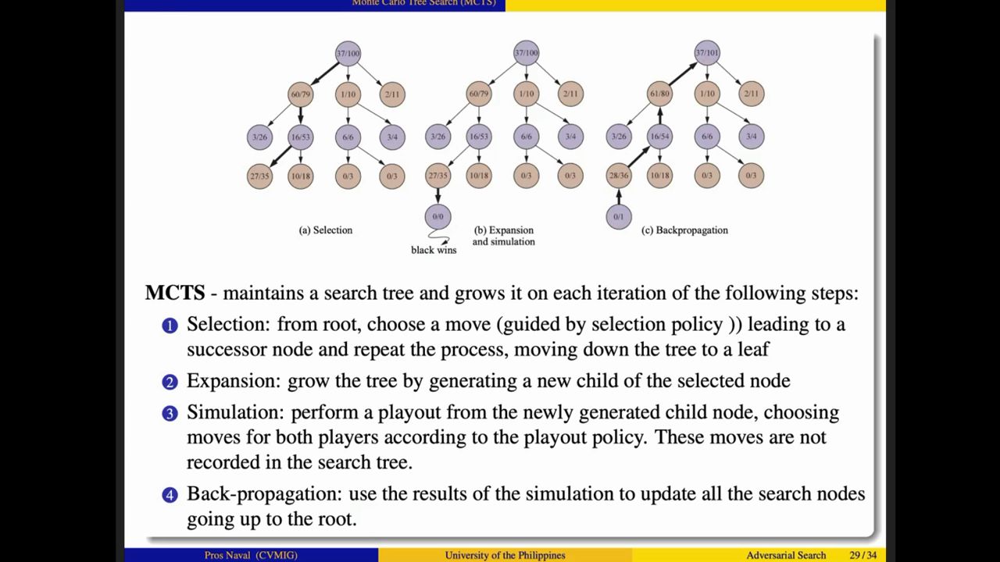

Every node is labeled **wins/playouts**. The root *"has a value of 37 out of 100. This is the number of wins that the node has backed up"* [00:50:41]; its children read 60/79, 1/10, 2/11 [00:51:20].

**(a) Selection** — follow the selection policy down the bold path 37/100 → 60/79 → 16/53; at the last choice, *"we know that we should choose this because it has 27 wins out of 35"* [00:51:20]:


**(b) Expansion + simulation** — grow the tree with a new child of the selected node, then perform a **playout** from it, choosing both players' moves per the playout policy; *"these moves are not recorded in the search tree"*. Result here: **black wins** [00:51:57].

**(c) Back-propagation** — use the simulation result to update every node up to the root [00:53:07]. *"So you have added one to the values here… from 27, it has become 28"* [00:52:33]:


```
27/35  → 28/36          Black's node, Black won: +1 win, +1 playout
16/53  → 16/54          White's node: wins stay 16, +1 playout   [00:52:33]
60/79  → 61/80          Black's node: +1 win, +1 playout
37/100 → 37/101 (root)  +1 playout                               [00:53:07]
```

### The algorithm, and when to prefer it [00:53:44]

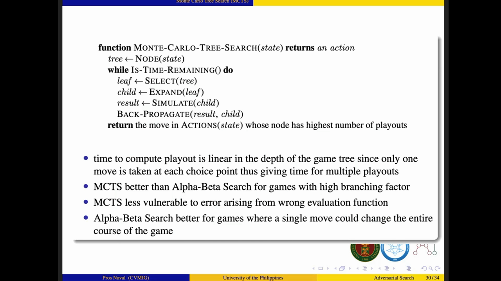

```
function MONTE-CARLO-TREE-SEARCH(state) returns an action
    tree ← NODE(state)
    while IS-TIME-REMAINING() do
        leaf   ← SELECT(tree)
        child  ← EXPAND(leaf)
        result ← SIMULATE(child)
        BACK-PROPAGATE(result, child)
    return the move in ACTIONS(state) whose node has highest number of playouts
```

Computing a playout is **linear in the depth of the game tree** — one move per choice point — leaving time for **multiple playouts** [00:53:44].

> **Exam hook — the comparison the lecture spells out** [00:53:44][00:54:17]:

| | MCTS | Alpha-beta |
|---|---|---|
| high branching factor (Go) | **better** — *"for Go, MCTS is better"* | limited to 4–5 ply |
| wrong evaluation values | **less vulnerable** to such errors | more vulnerable |
| a **single move can change the entire course** (chess) | — | **preferred** — *"for chess… still preferred"* |

---

## C.6 Stochastic games [00:54:49]

### Chance nodes [00:54:49]

The example is **backgammon** — *"We need not know how to play this. It's just important to know that when we have stochastic games, we have a tree that has chance nodes"* [00:54:49]:

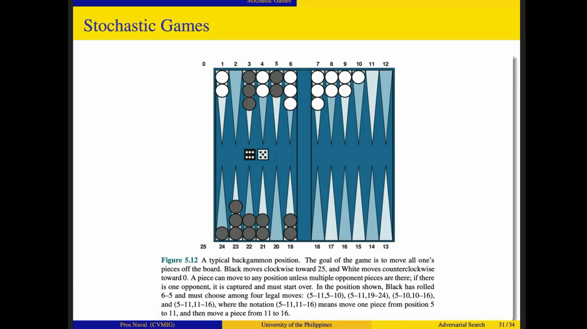

The tree now interleaves the players with the dice [00:55:20]:

```
MAX       △    your move
CHANCE    ◯    die roll — P = 1/36 (doubles: 1-1, 6-6), 1/18 (non-doubles: 6-5)
MIN       ▽    opponent's move
CHANCE    ◯    die roll        "depending on the outcome of the die roll, you
MAX       △    …                go to this node, or this other node" [00:55:20]
TERMINAL       2 −1 1 −1 1
```

### Expectiminimax [00:55:50]

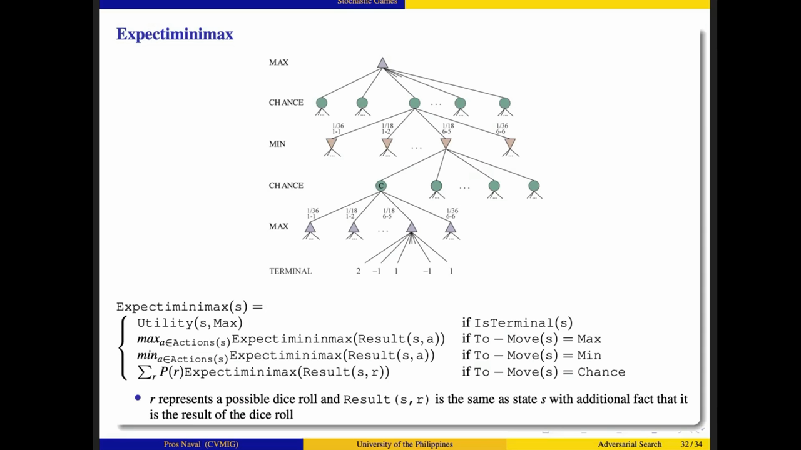

Minimax plus a fourth case for chance nodes [00:55:50]:

```
Expectiminimax(s) =
  Utility(s, Max)                                      if IsTerminal(s)
  max_{a ∈ Actions(s)} Expectiminimax(Result(s, a))    if To-Move(s) = Max
  min_{a ∈ Actions(s)} Expectiminimax(Result(s, a))    if To-Move(s) = Min
  Σᵣ P(r) · Expectiminimax(Result(s, r))               if To-Move(s) = Chance
```

At a chance node *"we take the expected minimax and weigh that with a probability"* [00:56:20]; *r* is a possible die roll, and Result(s, r) is state *s* **plus the fact that it is the result of the die roll** [00:56:56].

### Interpreting chance nodes: a trap [00:56:56]

*"We have to be a little careful about interpreting the chance nodes because it could give wrong results"* [00:56:56].


Two trees, identical in shape, weights .9/.1 on every chance node. Left tree leaf evaluations **2, 3, 1, 4**; right tree **20, 30, 1, 400** — an order-preserving transformation of the left [00:57:36]:

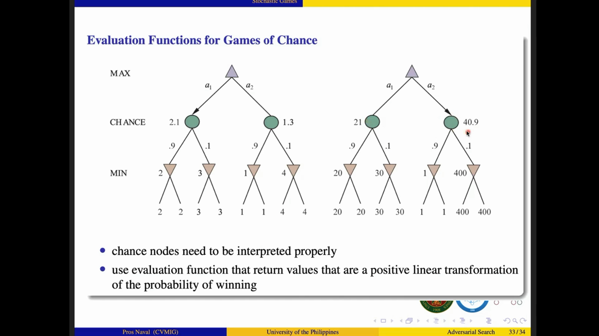

```
       chosen ▶ a₁                                   a₂ ◀ chosen
MAX         ●                                  ●
          /   \                              /   \
CHANCE  2.1    1.3                         21     40.9
      .9/ \.1 .9/ \.1                    .9/ \.1  .9/ \.1
MIN     2   3   1   4                    20   30   1   400

.9·2 + .1·3 = 2.1 > 1.3  → a₁            .9·1 + .1·400 = 40.9 > 21 → a₂
```

*"For the first tree here, the backup value is 2.1, and therefore we choose action* a₁*"* [00:57:36]; in the second tree *"a₂ is selected because the backup value is higher"* [00:58:08]. Same ordering of leaf values, **different decision**. The fix:

> Use an evaluation function that returns values that are a **positive linear transformation of the probability of winning** [00:58:08] — i.e., transform raw evaluations into probabilities of winning.

That closes the lecture [00:58:40].

---

### Part C exam checklist

| Concept | Be able to… | Where |
|---|---|---|
| Vocabulary bridge | translate perfect info / move / position ↔ fully observable / action / state | [00:02:59] |
| Uncertainty | name the 3 sources: incomplete knowledge, opponent, computational constraints | [00:04:04] |
| Contingency + anytime | why all games are contingency problems; define anytime algorithm | [00:05:13] |
| Base/meta trade-off | define both levels + the recovery condition; link to eval-function cost | [00:07:35][00:35:43] |
| Formal game model | list S₀, To-Move, Actions, IsTerminal, Utility(s, p) | [00:08:37] |
| Minimax | 3-case formula; perfect-play assumption; O(bᵐ) time, linear space | [00:13:45][00:14:57] |
| Hand-simulation | back up a two-ply tree (B=3, C=2, D=2 → A=3, play a₁); vectors for multiplayer | [00:16:43][00:19:36] |
| Imperfect decisions | the two modifications: evaluation function + cut-off test | [00:23:47] |
| Alpha-beta | define α ("at least") / β ("at most"); the prune-at-n rule; prune a tree by hand | [00:28:13] |
| Move ordering | O(b^(m/2)) perfect vs O(b^(3m/4)) random; chess 35 → √35 ≈ 6; captures → threats → forward → backward | [00:29:59][00:31:11] |
| Chess Eval | piece values 1/3/3/5/9; +0.5 pawn structure, −1/3 isolated; linear Σwᵢfᵢ needs independent features | [00:34:38][00:36:50] |
| Horizon effect | define it (nuisance check, threat over the horizon); secondary search vs killer heuristic | [00:38:24] |
| Deep-search tricks | quiescence; singular extension (why Deep Thought beat HiTech); ProbCut = probably vs provably outside window | [00:41:45][00:43:59] |
| Opening/endgame tables | why used; KRK / KBNK; 400 trillion entries | [00:44:29] |
| Go → MCTS | why alpha-beta fails (b > 360, 4–5 ply, no good Eval); MCTS = average utility over playouts | [00:47:15][00:47:49] |
| MCTS mechanics | run selection → expansion → simulation → back-propagation; update wins/playouts by hand | [00:50:03][00:52:33] |
| MCTS vs alpha-beta | branching factor, eval-error tolerance, single decisive moves | [00:53:44] |
| Expectiminimax | 4-case formula; chance case Σᵣ P(r)·(…) | [00:55:50] |
| Chance-node trap | the a₁ → a₂ flip (2.1/1.3 vs 21/40.9); fix = positive linear transformation of P(win) | [00:57:36][00:58:08] |
